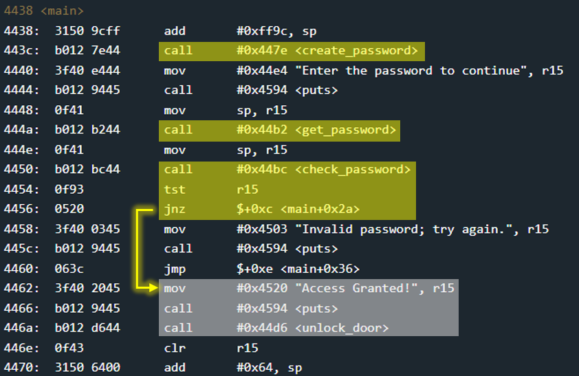
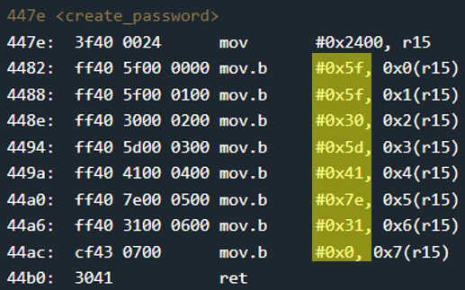
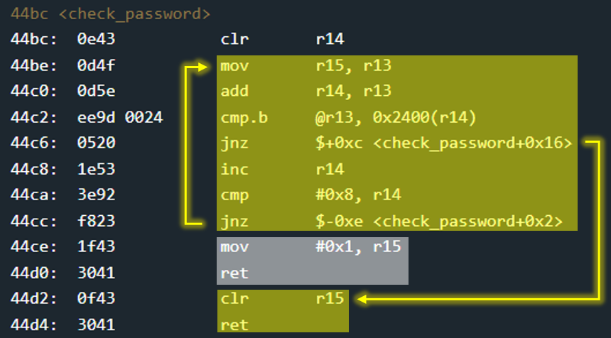

# New Orleans - 10 points
 
## The idea
A challenge that aims to show that saving passwords in the source file is very bad.

## The way
In the main function you can see that a function called `create_password` is called, and then the password is taken from the user by the `get_password` function and it is checked by the `check_password` function. If the value returned from `check_password` is not 0, `unlook_door` is called.

</img>

Let's look at the `create_password` function first. We will find that the password characters are placed into the address 0x2400 like a string and are completely exposed and visible.

</img>

Finally, we will also look at `check_password`.
It is not difficult to see that a direct comparison is made between the input from the user and the visible password. If one of the comparisons is negative, it will return 0. Otherwise, If the bytes of input from the user are successfully compared to the password (including 0x0 at the end, so total 0x8 bytes) it will return 1.

</img>

So, password is very clearly..


## The cracking input (as bytes)
```
5f5f305d417e3100
```


