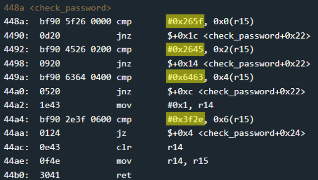

# Sydney - 15 points
 
## The idea
A challenge very similar to New Orleans that illustrates how bad it is to keep the password in the source code.

## The way

The function `main` of this challenge is very similar to the main function of New Orleans, except that the inner code of the `unlook_door` function is written here in the main.

This is also the place to say, that opening the door is activation of the interrupt numbered 0x7f.

</img>

Let's examine the `check_password` function.
It appears that a comparison is made between pairs of bytes of the input from the user at the address stored in r15 with characters that are exposed to the eyes of any viewer.

Concatenating those bytes taking into account little endian will yield the password.

</img>

So, the password is any series of bytes starting with
0x8 these bytes.

## The cracking input (as bytes)
```
5f26452663642e3f
```


