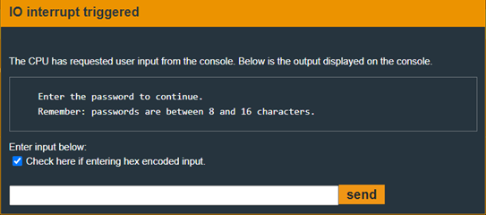
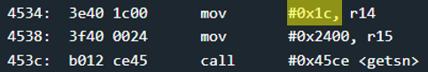
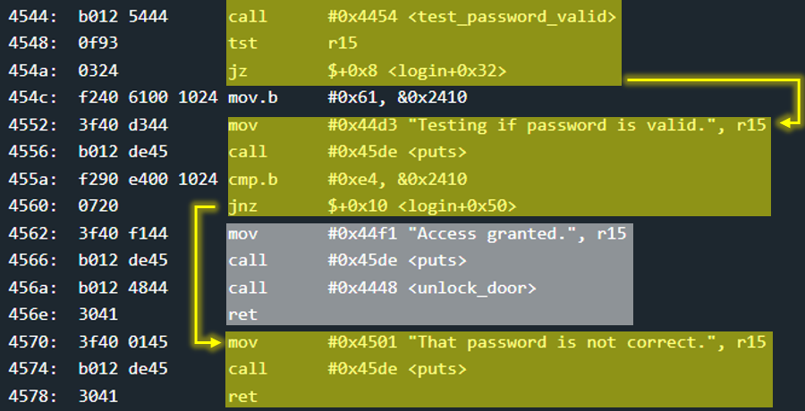

# Hanoi - 20 points
 
## The idea
A very simple case of exploiting the possibility to insert more input than the amount explicitly told to the user.

## The way
First of all, we will notice that the requirement from the user is a password whose size is up to 0x10 bytes.

</img>

But, a careful look into the `login` function indicates that input as large as 0x1c bytes can be entered (into 0x2400 address).

</img>

At the beginning of the challenge it was said that there is an external component with which the lock communicates.

It means the password is not in the code this time..

A look at the function `test_password_valid` confirms this, since checking the input from the user against the password is done using an interrupt (external code).

Therefore there is no point in bringing a photo of the function here.

But, after the above test, a strange process takes place. If `test_password_valid` returns 0 (in our case it will always happen because we have no way of knowing what the password is), then it will compare byte 0x2410 with the value 0xe4 and open the door if they are equal.

But, if a 1 was returned from the `test_password_valid` function, then we would put 0x61 at the same address and the door would not open.

That's why the process is strange to me...

</img>

So, remember that the user can insert more than 0x10 bytes? Beauty.

If byte 0x11 (which comes out at address 0x2410) that is entered as input is equal to 0xe4, the door will open!

## The cracking input (as bytes)
```
00000000000000000000000000000000e4
```


