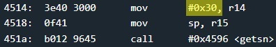
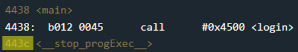
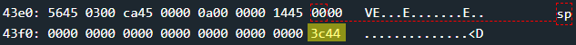
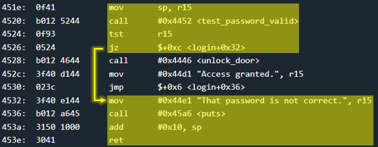

# Cusco - 25 points
 
## The idea
A classic case of stack overflow where we will overwrite the return address to caller function with the address of the function that will open the door.

## The way
Just like in the Hanoi challenge, here too the user is asked to enter an input that is up to 0x10 characters long. And this time too it seems he can do more. In this case - up to 0x30 characters:

</img>

But, unlike the Hanoi, here the inputs insert into the head of the stack (address inside _sp_ register).

Note that the `login` function is called directly from `main`. This means that the return address 0x443c enters the stack, and immediately after it the `login` stack frame will start (toward the lower addresses).

</img>

And we will also note that the stack frame of login cannot really contain 0x30 without overriding part of the stack frame of main.

This can be seen right at the moment when we want to call `getsn` and put the input directly at the top of the stack:

</img>

Recall that since we do not have access to the code that checks the password, we will not be able to guess the correct password. And the test_password_valid function will return 0. Therefore, we would like the program to open the door even if the password is incorrect.

</img>

Therefore, all we will have to do is make sure that when the code reaches the ret command of the `login` function, it jumps to `unlock_door` at address 0x4446.
Therefore the cracking input will contain 0x10 random bytes, and another 0x2 bytes that will overwrite the return address to the sort (don't forget the little endian). Bingo.

## The cracking input (as bytes)
```
000000000000000000000000000000004644
```


