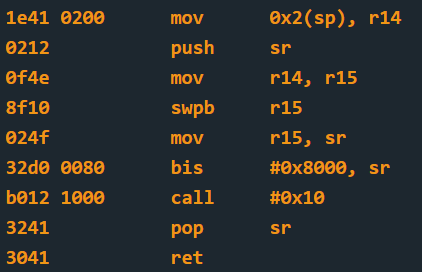

# Reykjavik - 35 points
 
## The idea
First and simple use of the disassembler.

## The way
First, we will look at the program as a black box. That is, by running only.

</img>

When we look at `main`, we will notice that two functions may interest us. One named `enc`, and the other has no name.

</img>

Out of basic curiosity we will check the memory of the address 0x2400 and find that there is nothing there (before running the program).

</img>

When we get to `main`, even before we run it, we will discover that the memory at address 0x4538 has been copied to the memory at 0x2400 by the `__do_copy_data` function.

</img>

</img>

</img>

Actually I don't know why exactly it happens like this.. but we will continue.
We'll notice that without seeing the contents of the `enc` function, when it finishes, the entire contents at address 0x2400 have changed.

</img>

</img>

First of all, to understand where the function that starts at 0x2400 ends, we will look for the ret command. In hexadecimal the command is 3041, which immediately gives us a division of the above code into two different functions.

So we will disassemble first the short function, and this is the code we will get:

</img>

This is exactly the code of `INT` from the previous challenges.

So, the long code is surely also responsible for printing the message to the screen, both receiving the input from the user and comparing it to the password.

You can also see it in the code itself in the next picture, and also deduce it ourselves. Because so far, for the user "nothing happened", and immediately after this function the program ends...

</img>


## The cracking input (as bytes)
```
7468
```


