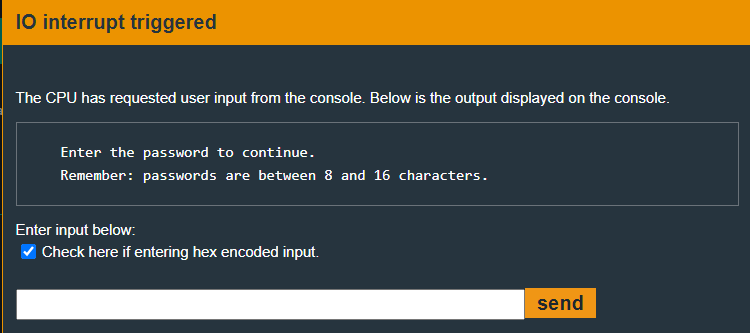
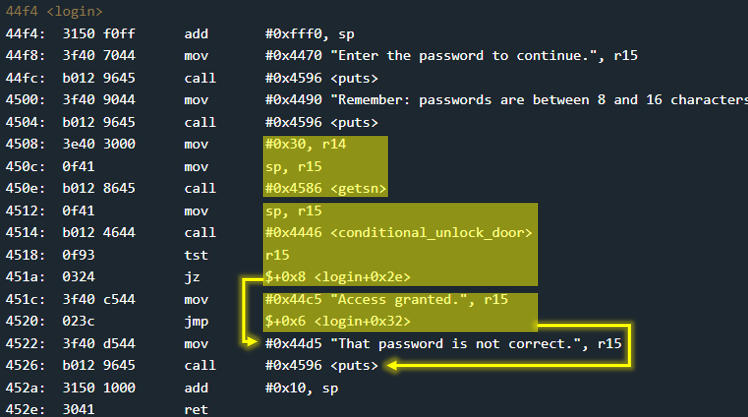
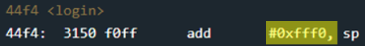
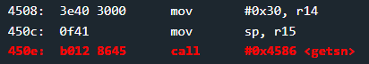
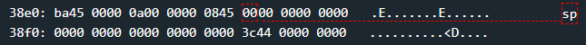

# Whitehorse - 50 points
 
## The idea
A case similar to the Stack Overflow of the Cusco challenge, in which we will also overwrite a return address, as well as a parameter for it.

## The way
First, we will look at the program as a black box. That is, by running only.

</img>

In function `main` there is only a call to `login`. That's why we'll examine `login` first.

</img>

*Explanetion:*
* Receiving input from the user.
    * up to 0x30 bytes
    * the input goes to the top of the stack
* Checking the input against the password.
    * `conditional_unlook_door` function probably opens the door if the password is correct.
    * interrupt is used in it.
* Whatever conditional_unlock_door returned, the program will terminate.

We note that the user was indeed asked to enter input up to 0x10 bytes long. And let's also note that technically it can be up to 0x30.

But the important part is that the `login` stack frame has only 0xf bytes allocated:

</img>

* 0xfff0 == -0x10

Therefore, so far we are in exactly the same situation as in the Cusco challenge. Let's look at the state of the stack just before receiving input from the user:

</img>

</img>

The main difference between the current challenge and the Cusco challenge, is that now we don't have a function that opens the door directly. Therefore, a little thought is required regarding the overwriting...

We know that opening the door is done using interrupt 0x7f in the following way:
```x86asm
addr1: push 0x7f
addr2: call #0x1337 <INT> ; 0x1337 is address of INT
addr3: ...                ; addr3 is the return address after call abouve.
addr4: ...
```

* The stack:
    * after line 1: 7f00
    * after line 2: [addr3]7f00
* Example:
    * if addr3 equals to 0x1234
    * so the stack will contain: 34127f00

Conclusion: When passing parameters to a function through the stack, the distance between the last parameter passed and the sp register (if the called function did not move it) is 0x2 bytes.

So, the address we will overwrite will be that of the INT function, in this case 0x4532.

In addition, we will give it as a parameter the value 0x7f at a distance of 0x2 bytes from the sp register that will be after the ret operation.

note: don't forget the little endian.


## The cracking input (as bytes)
```
00000000000000000000000000000000324500007f00
```


