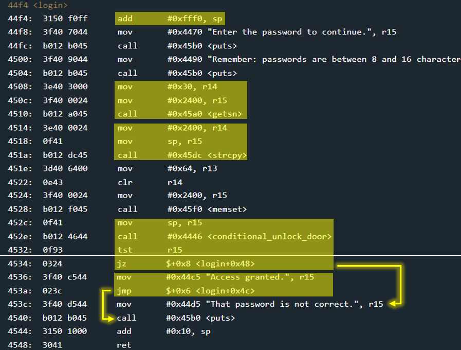

# Whitehorse - 50 points
 
## The idea
Just like the Whitehorse challenge with a small addition - the `strcpy` function.

## The way
The main function only contains a call to login. Therefore we will now examine login.



*Explain:*

* The login stack frame contains 0x10 bytes.
    * 0xfff0 == -0x10
* Accepting input from the user
    * up to 0x30 bytes long.
    * entered into memory at address 0x2400
* Transferring input from the user from memory to the top of the stack
    * using `strcpy` function.
* Opening the door if the password is correct
    * using `conditional_unlock_door`.
    * we will never know the password
    * so the function will always return 0 for us
* Regardless of the value returned from `conditional_unlock_door`, the `login` will return to `main` and the program will end.

Something you should know about `strcpy`:
**It doesn't stop copying until it sees the value 0x0**

And so as long as the input received at 0x2400 is long enough, when it is copied to the top of the stack we can use it to overwrite the return address just like in the Whitehorse challenge.

So the address we want the return value to replace is 0x454c of `INT` with the value 0x7f as a parameter. In addition, all the bytes that are not the last byte will not be 0x0 - so that strcpy does not stop copying in the middle.

## The cracking input (as bytes)
```
010101010101010101010101010101014c4501017f00
```


