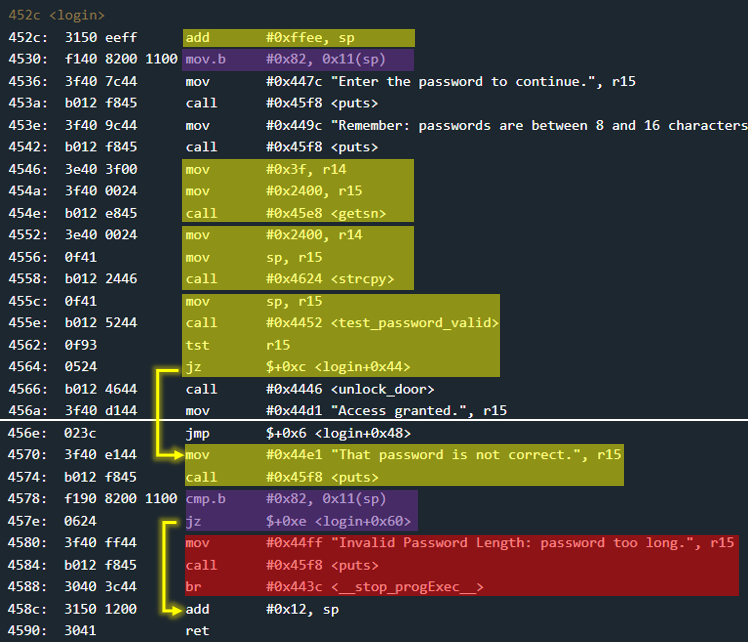

# Johannesburg - 20 points
 
## The idea
Bypassing a naive mechanism that should detect stack overflow.

## The way
In the black box test there is no difference from the previous challenges.

That is, the user is asked to enter up to 0x10 bytes as input.

</img>

The main function only contains a call to login. Therefore we will now examine login.

We can see that there is a mechanism that places a certain value into the 0x11 byte of the stack (from above).

After the input from the user enters the stack, a check is made that the value still exists.

The goal is to detect a violation of the value (which actually results from a overwriting) and in this case to immediately stop the program.

</img>


## The cracking input (as bytes)
```
0101010101010101010101010101010101824644
```


