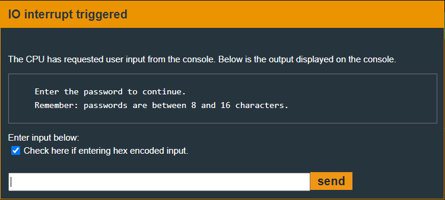

# Johannesburg - 20 points
 
## The idea
Bypassing a naive mechanism that should detect stack overflow.

## The way
In the black box test there is no difference from the previous challenges.

That is, the user is asked to enter up to 0x10 bytes as input.

</img>

The function `main` only contains a call to `login`. Therefore we will now examine `login`.

We can see that there is a mechanism that places a certain value into the 0x11 byte of the stack (from above).

After the input from the user enters the stack, a check is made that the value still exists.

The goal of the mechanism is to detect a violation of the value (which actually results from a overwriting) and in this case to immediately stop the program.

</img>

*Explain:*
* The `login` stack frame is 0x12 in size.
    * 0xffee == -0x12
* put value 0x82 into the 0x11 byte from the top of the stack.
    * if this byte changes, it means the user entered more than 0x10 bytes in the input.
* Gets the user input
    * up to 0x3f
    * the input enters into memory at adderss 0x2400
* Copy the input from 0x2400 into the top of the stack.
* Opening the door if the password is correct
    * using `conditional_unlock_door`.
    * we will never know the password
    * so the function will always return 0 for us.
* Checking that the value 0x82 is still there
    * if not, program will terminate.

Therefore, all we will have to do is make sure that in the 0x11 byte that we will overwrite, we will "leave" the value 0x82.

In this way, it will be printed on the screen that the password is incorrect - but this way we will get to the ret command which will jump to an interrupt that will unlock the door.

So, the address of `unlock_door` is 0x4446 and we can't enter the value 0x0 because of the `strcpy` function. From here, the creation of the cracking input is easy.

## The cracking input (as bytes)
```
0101010101010101010101010101010101824644
```


