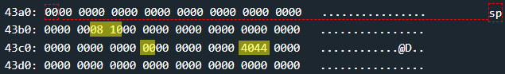

# Santa Cruz - 50 points
 
## The idea
Bypassing a naive mechanism for detecting a deviation from the desired length by changing the values used as limits.

## The way
Black box testing immediately shows us that two apparent inputs are required to open the door. user name and password.

</img>
</img>

In function `main` there is only a call to `login`, so we will focus on `login`.

Similar to the Johannesburg challenge, what we see there is the setting of the value 0x0 in a very specific location, so that if it has changed it means that too large an input has been entered (exactly the same purpose as the value 0x82 in Johannesburg).

In contrast to it, we also see a determination of minimum and maximum length values for entering the password.

</img>
</img>
</img>
</img>

*Explain:*
1. Determining the set-points values.
    * 0x0 to detection of ovewriting
    * 0x8 is the minimum length for password
    * 0x10 is the maximum length for password
2. Getting the username into 0x2404
3. Copy the username from 0x2400 into the stack at 0x43a2
    * using `strcpy`
4. Getting the password into 0x2404
5. Copy the password from 0x2400 into the stack at 0x43b5
    * using `strcpy`
6. Calculating password size from the user
    * _r11_ contains the password length.
7. Checking that the length of the password is not greater than the maximum value.
    * if not, jump to 9.
    * else, continue to 8.
8. Prints to the user that the password is too long and ends the program run.
9. Checking that the length of the password is not less than the minimum value.
    * if so, continue to 10.
    * else, skip 10.
10. Prints to the user that the password is too short and ends the program run.
11. Performs the `test_username_password_valid` function operation
    * We will always get 0 because we have no idea what the correct username and password are.
12. Checking that the value 0x0 is still in place.
    * if not, continue to 13.
    * else, skip 13 and reaches the end of the function with the ret command
13. Prints to the user that the password is too long and ends the program run.
    * Not because an grater length then the maximum password size was detected, but because an overwrite was detected.


Summary:
* The user enters a username and password. 
* 3 tests are performed:
    * maximum length for the password
    * minimum length for the password
    * an overwrite test similar to the one from the Johannesburg challenge.
* If one of the above tests fails, the program will terminate immediately without reaching ret at the end of the function.


That is, we would like to somehow, using the username and password, overwrite the value back to `main` so that it contains the address to `unlock_door` and also leave the value 0x0 in its place.

Let's look at the stack before entering the username:



* 0x8 - minimum password length
* 0x10 - maximum password lenght
* 0x0 - the value for detecting overwriting
* 0x4440 - return value to the `main`

Technically, both the username and password can be long enough to overwrite the return value value (up to 0x63 bytes).

But we will note that the input that will overwrite the return value cannot also be the one that will "leave" the value 0x0 in its place. Because otherwise `strcpy` will not copy the entire input up to the return value but will stop at the same 0x0..


Therefore, we can do this:
* The username will be long enough to overwrite the return value.
* The password will be long enough so that it ends with 0x0 at the end of its string exactly where the 0x0 of the test is located.
* In order not to fail the maximum password length test, the username will not only overwrite the return value but also the maximum length of the password.

For example, this is what the stack will look like when the username is `1111111111111111111111111111111111 08 12 1111111111111111111111111111111111111111111111 4a44`:


* 0x12 - maximum password lenght AFTER OVERWRITING
* 0x1 - The value 0x0 was overwrite and became something else. Will be fixed in next input 
* 0x444a - address of `unlock_door`

Now, we will enter the following password: `2222222222222222222222222222222222 00`. So that its last character will be 0x0 exactly where it should be. And it will match the "new" length that was changed exactly for this purpose in the previous input.


* 0x0 - fixed.

With these inputs, the three tests passed successfully. And although in any case it will be printed to the user that the username and password are incorrect, but when we reach the ret command at the end of the `login` function and jump to `unlock_door`.


## The cracking input (as bytes)
```
1111111111111111111111111111111111 08 12 1111111111111111111111111111111111111111111111 4a44
```
```
2222222222222222222222222222222222 00
```
