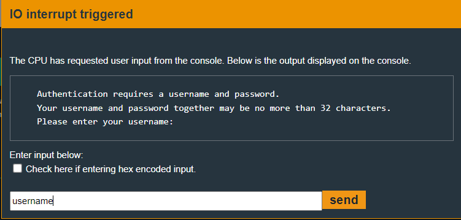
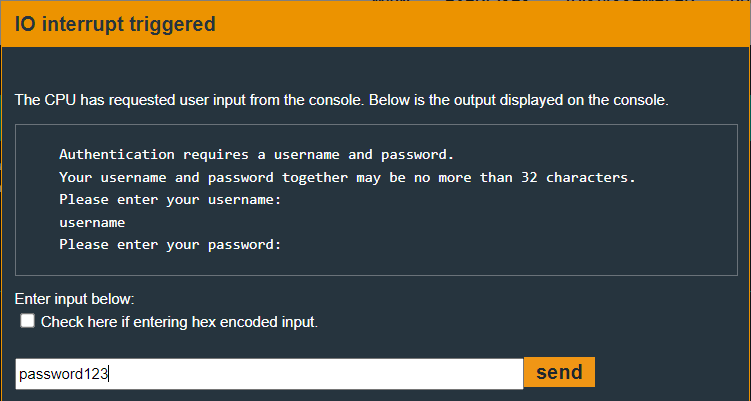
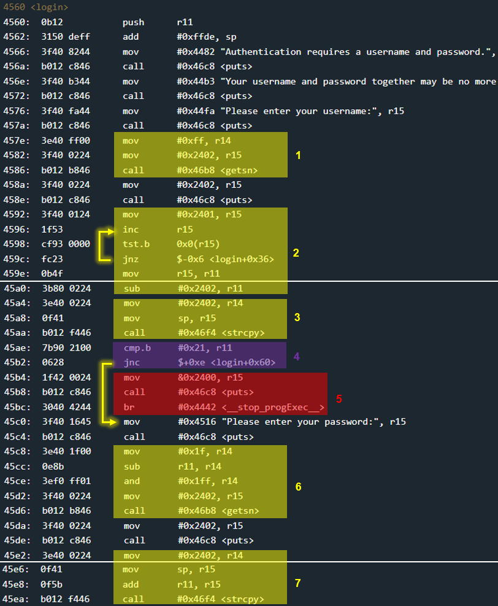
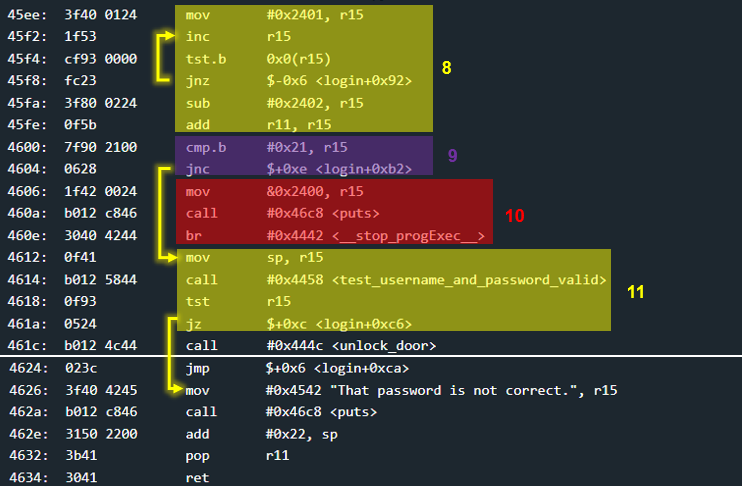

# Jakarta - 40 points
 
## The idea
Bypassing the input length verification mechanism using a game of byte addition sums.

## The way
In the black box test, it seems that a username and password must be entered whose total length does not exceed 0x20 bytes.

</img>
</img>

In function `main` there is not too much except a call to `login`. So we will examine `login`.

</img>
</img>

*Explain:*
1. Get username from user
    * up to 0xff bytes
    * enters memory at address 0x2402

2. Calculation of username length
    * _r11_ contains the username length (without 0x0 at the end)

3. Copying the username to the top of the stack
    * using `strcpy`

4. Verification that the length of the username does not exceed 0x1f
    * 0x20 - 0x1 = 0x1f. password length without 0x0 at the end..
    * if the test failed, we will continue to 5.
    * otherwise, we will skip 5.

5. Printing to the screen that the password is too long, and the end of the entire program
    * this is not a mistake, indeed the length of the username is checked and an output is printed that talks about the password.

6. Get passwrord from user
    * up to 0x1f - len(username) bytes ⚠️<font color='red'>BAG IS HERE!</font>⚠️
    * enters memory at address 0x2402. 

```python
username = '11' * 0x20
```

```python
password = '22222222' + ' 4c44 ' + '22' * (0xe0 - 0x6)
```


## The cracking input (as bytes)
```
1111111111111111111111111111111111111111111111111111111111111111
```
```
22222222 4c44 2222222222222222222222222222222222222222222222222222222222222222222222222222222222222222222222222222222222222222222222222222222222222222222222222222222222222222222222222222222222222222222222222222222222222222222222222222222222222222222222222222222222222222222222222222222222222222222222222222222222222222222222222222222222222222222222222222222222222222222222222222222222222222222222222222222222222222222222222222222222222222222222222222
```
