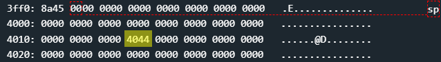
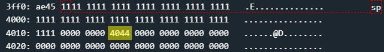
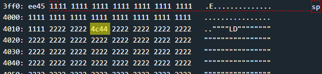

# Jakarta - 40 points
 
## The idea
Bypassing the input length verification mechanism using a game of byte addition sums.

## The way
In the black box test, it seems that a username and password must be entered whose total length does not exceed 0x20 bytes.

</img>
</img>

In function `main` there is not too much except a call to `login`. So we will examine `login`.

</img>
</img>

*Explain:*
1. Get username from user
    * up to 0xff bytes
    * enters memory at address 0x2402

2. Calculation of username length
    * _r11_ contains the username length (without 0x0 at the end)

3. Copying the username to the top of the stack
    * using `strcpy`

4. Verification that the length of the username does not exceed 0x1f
    * 0x20 - 0x1 = 0x1f. username length without 0x0 at the end..
    * if the test failed, we will continue to 5.
    * otherwise, we will skip 5.

5. Printing to the screen that the password is too long, and the end of the entire program
    * this is not a mistake, indeed the length of the username is checked and an output is printed that talks about the password.

6. Get passwrord from user
    * up to 0x1f - len(username) bytes ⚠️
    * enters memory at address 0x2402.

7. Copying the password to the top of the stack after the username
    * using `strcpy`

8. Calculation of the total length of the username and password
    * _r15_ contains the len(username + password)

9. Verification that the length of the username and the password together does not exceed 0x1f
    * 0x20 - 0x1 = 0x1f. username+password length without 0x0 at the end of the password.
    * if the test failed, we will continue to 10.
    * otherwise, we will skip 10.

10. Printing to the screen that the password is too long, and the end of the entire program

11. Checking that the username and password are correct
    * We have no way of knowing the login details so we will always fail and skip opening the door.


Summary:
* Receiving a username and checking its length
     * if it is too long, the program will end
* Receiving a password and checking the total length of the username and password
     * if it is too long, the program will end
* Checking correctness of username and password
     * always fail, we will skip opening the door and reach the `login` ret command.


We want to overwrite the return value to `main` with the address of `unlock_door` (0x444c) and pass all the correctness checks of the lengths.


Let's pay attention to the test process from the end to the beginning:

* The program ends immediately if the lower byte of register _r15_, which contains the size of the username and password together, is large equal to 0x21.
     * If _r15_ will be 0x0100 for example, we will pass the test successfully!

* The program limits the input size of the password to be: (0x001f - len(password)) & 0x01ff
     * If the username size is 0x20, the password size will be limited to 0x1ff.
     * We cannot let username be longer because then it will fail the length check.
   
* So for _r15_ to be 0x0100, the size of the password should be 0xe0
     * because 0x20 + 0xe0 = 0x100


Let's look at the stack before entering the username:

</img>
* 0x4440 - return value back to `main`.

And now we will see the memory when we enter the following input as username (run the code section in Python interpreter):

```python
'11' * 0x20
```

</img>

We will use the password input whose total length is 0xe0 bytes to overwrite the return value to be the address of `unlock_door` (0x444c):

```python
'22222222' + ' 4c44 ' + (0xe0 - 0x6) * '22'
```

</img>

And that's how we managed to bypass the safety mechanism, put in a long input that will override the return value and open the door.

## The cracking input (as bytes)
```
1111111111111111111111111111111111111111111111111111111111111111
```
```
22222222 4c44 2222222222222222222222222222222222222222222222222222222222222222222222222222222222222222222222222222222222222222222222222222222222222222222222222222222222222222222222222222222222222222222222222222222222222222222222222222222222222222222222222222222222222222222222222222222222222222222222222222222222222222222222222222222222222222222222222222222222222222222222222222222222222222222222222222222222222222222222222222222222222222222222222222
```
