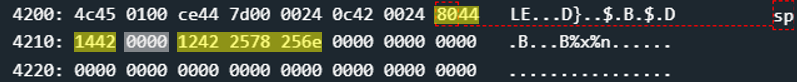

# Addis Ababa - 50 points
 
## The idea
The weakness of printf - change of control value

## The way
Black box testing tells us that the input to unlock is username and password separated by colons.

</img>

Let's look at function `main`:

</img>

### Explain the main:
1. Get input from user
    * up to 0x13 bytes
    * insert into memory at address 0x2400

2. Copy the user input from 0x2400 into the stack
    * top of the stack at 0x4212
    * the input inserts into 0x4214
    * using `strcpy`

3. Checking the correctness of the input
    * using `test_password_valid` that using interupt so we cant guess the password
    * the function will always return 0 for us
    * result move from _r15_ to 0x4212.
    * so, always at this point: *(0x4212) == 0x0

4. Printing the input from the user to the screen
    * using `printf`
    * so far in the other challenges we have used `puts`, So the use of `printf` raises suspicion...

5. Checking the result of `test_password_valid`
    * always jump to stage 7 (read step 3 again)

6. Unlock the door.

7. Prints that the input is incorrect.


### Summary:
* Before printing the input from the user to the screen, the stack contains two things:
    * 2 bytes (address 0x4212) whose total value is 0 if the input is incorrect
    * the input from the user immediately after them (address 0x4214)
* After printing, these 2 bytes are checked
    * If they are 0, we lost
    * Otherwise, the door opens
* Conclusion: we will have to use `printf` to write a value other than 0 to those 2 bytes - at  address 0x4212

### How to exploit:

So far I have known the weakness of printf in the way the stack can be printed (from top to bottom, i.e. from low to high addresses). A check on Google reveals to me that it is also possible to write to memory using %n, and the form of exploitation is the same.

So we will pay attention to the following things:
* the string to print is **in stack memory**
* to reach it from the top of the stack (just before the call to printf) you need to **skip 2 bytes** down (toward the higher addresses)

So the string that will break the door will contain 3 parts:
* at the end of it will be %n
* its beginning will consist of the bytes of the address 0x4212 (0x12 and 0x42) to which we want to write.
* In the middle there will be a certain number of %x (or any % something else) that will cause the bytes that contain the address to which we will write to be the "parameter of %n"
    * In this case there are only 2 bytes to skip, so a single %x is enough.

Note: there is no need to worry about a specific amount of characters before %n, because it is enough that it comes out in any case a number that is not 0.

### Illustration:

The following code constructs the malicious input according to the above requirements:

```python
('\x12\x42' + '%x' + '%n').encode().hex()
```

Stack memory:

</img>

* `8044` - 0x4480 is return value to `main` after `printf`
* `1442` - 0x4214 is pointer to string to printing (i.e. pointer to user input string)
* `0000` - This is the control value that needs to be changed
* `1242 2578 256e` - the input string `\x12\x42%x%n` as bytes

The parameters injected into the stack to exploit printf:
    
* `0000` is parameter of `%x`
* `1242` is parameter of `%n` - the exploit is here.

The stack immediately after printf:

</img>

* *(0x4212) != 0x0

Bingo.

## The cracking input (as bytes)
```
1242 2578 256e
```