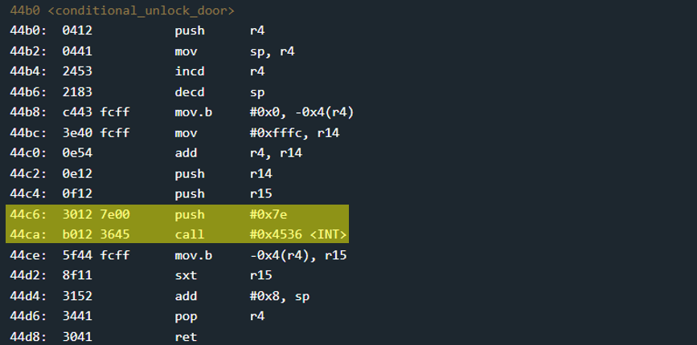

# Novosibirsk - 40 points
 
## The idea
The weakness of printf - very similar to Addis Ababa challenge. changing a parameter for Interrupt, so that instead of activating one thing, something else will be activated. like opening a door, for example...

## The way
Black box testing tells us that the input to unlock is just a username.

</img>

Let's look at function `main`:

</img>

### Explain the `main`:
1. Get user input
    * up to 0x1f4 bytes - a very long length..
    * insert into memory at address 0x2400

2. Copy user input from 0x2400 into the stack
    * copy to 0x420c, the top of the stack.

3. Prints the user input
    * using `printf`

4. Checking the correctness of the input
    * using `conditional_unlock_door` that interrupt.
    * we cant guess the right input, therefore the function will always return 0x0 to us.
    * so always jump to stage 6

5. Prints that access granted
    * note: We will never get here.
    * note: if we came here, no door would open, despite the fine print.

6. Prints that input is incorrect.


### Summary:

* Receive the user input

* Print it with `printf`

* Check the correctness of the input with `conditional_unlock_door`

* No matter what is returned, the door will not open.
    * there is not even any call to the function that will open the door in the program.

* **Things we don't have:**
    * address to overwrite

    * some control value that can be changed

* **Things we have:**
    * It is possible to insert a very long input, up to 0x1f4 bytes


### How to exploit:
We know that after `printf` to print the input, comes the `conditional_unlock_door` function. Let's look at it:

</img>

Inside the function there is a call to interrupt 0x7e.
If the value 0x7e was 0x7f, the door would open..

Let's look at function `conditional_unlock_door` in memory:

</img>

Address of value 0x007e is 0x44c8. so, all that's left to do is use printf to write the value 0x7f at address 0x44c8.

The string that will break the door will contain 3 parts:
* %n at the end
* its beginning will consist of the bytes of the address 0x44c8 (0xc8 and 0x44) to which we want to write.
* we would like the value 0x7f to be written to the specific memory. therefore we will need another 0x7f-0x2 random bytes int the middle, sitting before the %n.

Note: unlike the Addis Ababa challenge, this time the string from the user sits at the top of the stack at the moment before the call to printf (without 2 separating bytes). therefore there is no need to add any %x to match the parameter injected for %n, aka the value 0x44c8.

### Illustration:

The following code constructs the malicious input according to the above requirements:

```python
(b'\xc8\x44' + (0x7f - 0x2) * b'\x11' + b'%n').hex()
```

Stack memory:


The stack immediately after printf:


## The cracking input (as bytes)
```
c844 1111111111111111111111111111111111111111111111111111111111111111111111111111111111111111111111111111111111111111111111111111111111111111111111111111111111111111111111111111111111111111111111111111111111111111111111111111111111111111111111111111111111 256e
```