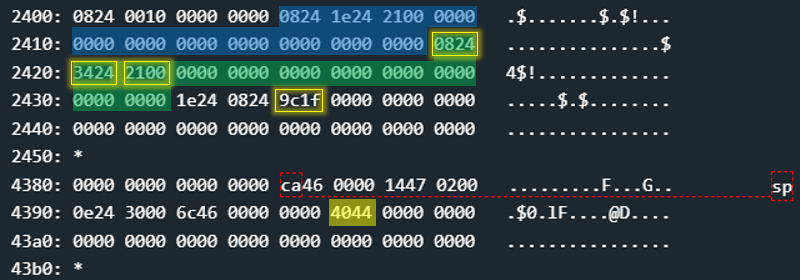
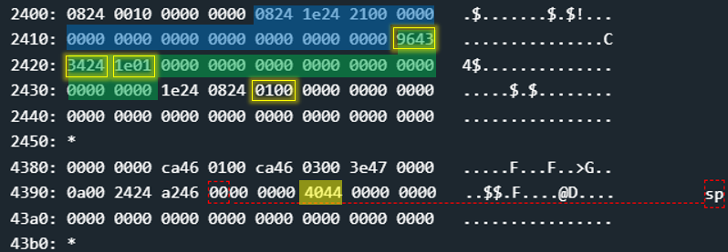
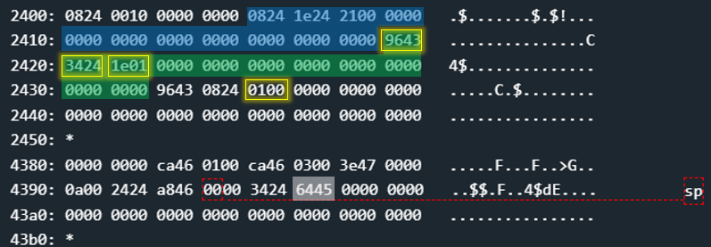

# Algiers - 100 points
 
## The idea
Exploit `free` by Heap overflow.

## The way

### Explain the `login`:

A black box test reveals to us that the user can enter 2 inputs.
In function `main` there is only a call to `login`. So let's look at the `login`:

</img>

1. Memory allocation
    * 0x10 bytes
    * using `malloc`

2. Memory allocation
    * 0x10 bytes
    * using `malloc`

3. Get the username
    * up to 0x30 bytes

4. Get the password
    * up to 0x30 bytes

5. Checking the correctness of the inputs
    * as usual, we will not be able to guess the input
    * so it will always fail and return 0
    * so it will always skip stage 6

6. Unlock the door
    * we will never get here.

7. Release the second memory allocation
    * using `free`

8. Release the first memory allocation
    * using `free`


### Conclusions from `login`:
* The `login` is called from `main`, so we will probably have to overwrite the return value somehow.

* The manipulation we can perform should be related to the fact that more input can be inserted than allocated.
    * in each allocation 0x10 bytes are allocated but 0x30 bytes can enter.
    * so we can overwrite the metadata of the allocations on the heap.
* direct overwrite of a return value is not possible immediately upon entering the input
    * so we note that the only thing that can have an effect and that we can use is the `free` function.

* Let's explore the memory release operation. it will be fun.


### Explain the `free`:

So, we needs to exploit `free` by heap overflow.
Let's look at the function:

</img>


From trial and error I was able to understand that the heap management is realized through a double linked list. But I think the right way to explain it without "handwaving" is to really reverse it. After a whole day (yes..) you can see in the c code the structure of the node, and the code of `free`:

```c
typedef struct meta
{
    struct meta *prev;
    struct meta *next;
    short size;         // Note: the last bit is the malloc flag.
} meta;
```
```c

#define META_SIZE 0x6

void free(void *addr)
{
    addr = (meta*)((char*)addr - META_SIZE);
    // r15 = addr

    // r13 = addr->size & 0xfffe
    addr->size &= 0xfffe; // power off the malloc flag

    // r14 = addr->prev
    // r12 = addr->prev->size
    if(addr->prev->size & 0x1 != 1)
    {
        // r12 = addr->prev->size + 6 + addr->size
        addr->prev->size += (META_SIZE + addr->size);
        addr->prev->next = addr->next;

        // r13 = addr->next
        addr->next->prev = addr->prev;
        
        // r15 = addr->prev
        addr = addr->prev;
    }

    // r14 = addr.next
    // r13 = addr.next->size
    if(addr.next->size & 0x1 != 1)
    {
        // r13 = addr.next->size + addr.size + 6
        addr->size += (addr->next->size + META_SIZE);
        addr->next = addr->next->next;
        addr->next->prev = addr;
    }

    return;
}
```
So, there are 4 options:
1. `prev` & `next` are NOT released:
    * allocation flag is turned off.

2. `prev` is released but `next` is NOT released:
    * allocation flag is turned off.
    * the total size is added to the size of `prev`.
    * the next of `prev` is updated to be the next.
    * the prev of `next` update to be the prev.

3. `prev` & `next` are released:
    * exactly as option 2.
    * the total size of next is added to `prev`.
    * update the next of `prev` to be the next of next.
    * update the prev of `next` to be the prev.
    * we can conclude that there was a union of 3 sections here.

4. `prev` is NOT released but `next` is released:
    * allocation flag is turned off.
    * the total size of the next append to the size.
    * the next updates to be the next of the next.
    * the prev of the next stay the current address.
    

### Summary of `free`:
The idea behind the function is very simple. After it marks the part to be released as released, it aims to unite it with the segments adjacent to it if they are also released, when the aim is to connect them from the top of the pile to the bottom.

### How to exploit:

Let's see the Heap and the Stack before inserting the inputs:



* blue - memory for first input. metadata and buffer.
* green - memory for second input. metadata and buffer.
    * `0824` - 0x2480, the prev of green.
    * `3424` - 0x2434, the next of green.
* `9c1f` - 0x9c1f, the size of next of green.
    * the important thing here is only the low bit that is turned off, and we will refer to that later.
* `4044` - 0x4440, the return value back to `main`.
    * sitting at address 0x439a.
    * we want to overwrite it to be the value 0x4564 which is the address of `unlock_door`.

***Let's put together everything we know so far:***
* If we refer to 0x4440 as "chunk size", then we will find that this "chunk" was released because the low bit is 0.
* Therefore if this "chunk" will be the prev of the green when `free` is activated on it, then according to `free` the total size of the green will be added to the value 0x4440.
     * We would like this sum to be 0x4564. (address of `unlock_door`)
     * So we will override the size of the green to be 0x11e ( = 0x4564 - 0x4440 - 0x6).
     * And of course we will also overwrite the prev of green to be the address of the malicious "chunk", 0x4396 ( = 0x439a - 0x4).

* But, remember that afterwards the prev of the green (which is the "chunk" we faked) will be united again with the next of the green.
     * Because of the value 0x1f9c, which is the size of the next of the green. And its low bit is equal to 0.
* And this will cause us to add another number to 0x4440 in addition to what has already been added. And that only complicates the calculation.
     * Therefore, we will overwrite the value 0x1f9c to be another value with low bit on.
     * For example, 0x0001.

***Summary:***
* The prev of the green will be the address of the malicious "chunk".
    * 0x4396
* The size of the green will complete the value 0x4440 to be 0x4564 after all
    * 0x011e
* The low bit of size of next of the green will be on
    * 0x0001
* The overriding of the metadata that belongs to green is done with the input of the username: `00000000000000000000000000000000 9643 3424 1e01`.
* The overriding of the metadata belonging to the next of green is done with the input of the password: `000000000000000000000000000000000 1e24 0824 0100`

This is how the memory looks like just before the first `free`:



This is how the memory looks like just after the first `free`:



Have a nice day!

## The cracking input (as bytes)
```
00000000000000000000000000000000 9643 3424 1e01
```
```
00000000000000000000000000000000 1e24 0824 0100
```