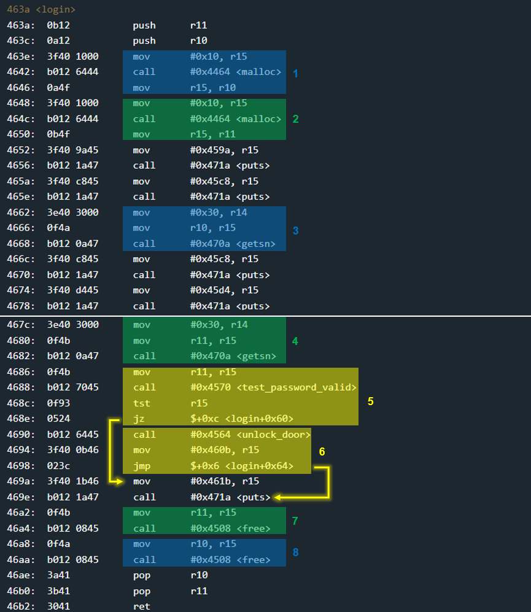
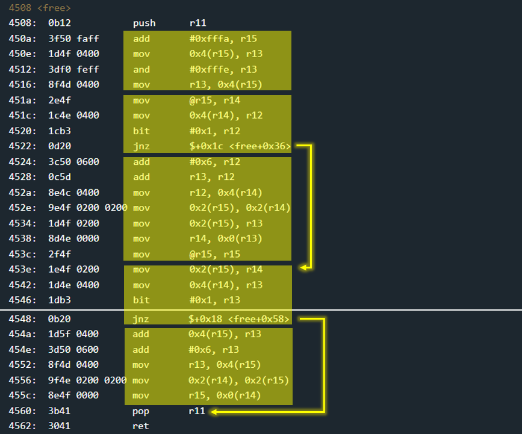

# Algiers - 100 points
 
## The idea
Exploit `malloc` & `free` by Heap overflow.

## The way
A black box test reveals to us that the user can enter 2 inputs.
In function `main` there is only a call to `login`. So let's look at the `login`:

</img>


### Explain the `login`:
1. 


### Summary:

So, we needs to exploit `free` by heap overflow.
Let's look at the function:

</img>


### Explain the `free`:

From trial and error I was able to understand that the heap management is realized through a linked list. But I think the right way to explain it without "handwaving" is to really reverse it. After a whole day (yes..) you can see in the c code the structure of the node, and the code of `free`:

```c
typedef struct meta
{
    struct meta *prev;
    struct meta *next;
    short size;         // Note: the last bit is the malloc flag.
} meta;
```
```c

#define META_SIZE 0x6

void free(void *addr)
{
    addr = (meta*)((char*)addr - META_SIZE);
    // r15 = addr

    // r13 = addr->size & 0xfffe
    addr->size &= 0xfffe; // power off the malloc flag

    // r14 = addr->prev
    // r12 = addr->prev->size
    if(addr->prev->size & 0x1 != 1)
    {
        // r12 = addr->prev->size + 6 + addr->size
        addr->prev->size += (META_SIZE + addr->size);
        addr->prev->next = addr->next;

        // r13 = addr->next
        addr->next->prev = addr->prev;
        
        // r15 = addr->prev
        addr = addr->prev;
    }

    // r14 = addr.next
    // r13 = addr.next->size
    if(addr.next->size & 0x1 != 1)
    {
        // r13 = addr.next->size + addr.size + 6
        addr->size += (addr->next->size + META_SIZE);
        addr->next = addr->next->next;
        addr->next->prev = addr;
    }

    return;
}
```
So, there are 4 options:
1. `prev` & `next` are NOT released:
    * allocation flag is turned off.

2. `prev` is released but `next` is NOT released:
    * allocation flag is turned off.
    * the total size is added to the size of `prev`.
    * the next of `prev` is updated to be the next.
    * the prev of `next` update to be the prev.

3. `prev` & `next` are released:
    * exactly as option 2.
    * the total size of next is added to `prev`.
    * update the next of `prev` to be the next of next.
    * update the prev of `next` to be the prev.
    * we can conclude that there was a union of 3 sections here.

4. `prev` is NOT released but `next` is released:
    * allocation flag is turned off.
    * the total size of the next append to the size.
    * the next updates to be the next of the next.
    * the prev of the next stay the current address.
    

### Summary:
The idea behind the function is very simple. After it marks the part to be released as released, it aims to unite it with the segments adjacent to it if they are also released, when the aspiration is to unite from top to bottom.

### How to exploit:

### Illustration:

The following code constructs the malicious input according to the above requirements:

```python
().hex()
```


## The cracking input (as bytes)
```

```