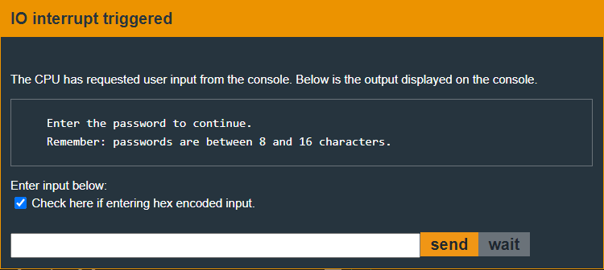
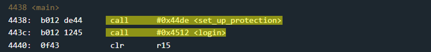
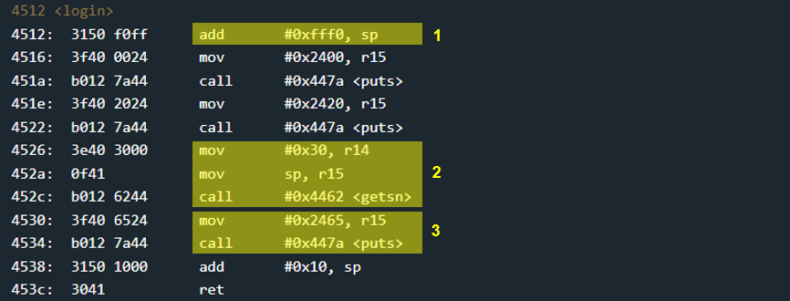

# Bangalore - 100 points
 
## The idea
Bypassing the mechanism of protected memory.

## The way

### Black box test:
The program asks the user for an input between 0x8 and 0x10 bytes long:

</img>

Is it really possible to insert only 0x10 bytes in total? From our experience so far, probably not. Let's see what happens here..

### Let's explore the code:

***Explain the `main`:***

As usual, the `main` calls `login`. And so we will probably have to overwrite a return value.

</img>

But unlike previous challenges, this time before `login` another function is activated, called `set_up_protection`.
For now we will skip it directly to login. If necessary, we will return to investigate it later.

***Explain the `login`:***

At first glance, `login` looks suspiciously too easy:

</img>


### How to exploit:


## The cracking input (as bytes)
```
00000000000000000000000000000000 ba44 4000 0000 0640 324000ff30401000
```