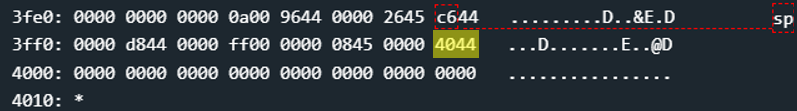
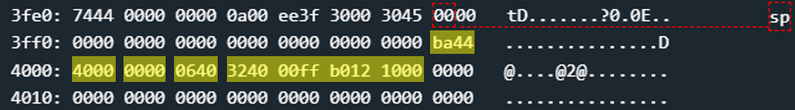

# Bangalore - 100 points
 
## The idea
Bypassing the mechanism of protected memory.

## The way

### Black box test:
The program asks the user for an input between 0x8 and 0x10 bytes long:

</img>

Is it really possible to insert only 0x10 bytes in total? From our experience so far, probably not. Let's see what happens here..

### Let's explore the code:

***Explain the `main`:***

As usual, the `main` calls `login`. And so we will probably have to overwrite a return value.

</img>

But unlike previous challenges, this time before `login` another function is activated, called `set_up_protection`.
For now we will skip it directly to login. If necessary, we will return to investigate it later.

***Explain the `login`:***

At first glance, `login` looks suspiciously too easy:

</img>

1. Allocate memory on the stack
    * up to 0x10 bytes

2. Get the user input
    * up to 0x30 bytes
    * insert it to the top of the stack

3. prints that password is inccorrect

***First attempt:***

It is very clear here that the return value can and should be overridden.
But, there is no function in the code segment that can open the door. Not even the well-known `INT`.
So we will have to inject a code that opens the door and jump to it.

If we investigate in another challenge what the `INT` function does with the parameter 0x7f, we find that the actual code that opens the door looks like this:

```asm
mov #0xff00, sr
call #0x10

; the bytes of the code after the assembler: 324000ffb0121000 
```

Return value at a distance of 0x10 from the top of the stack.
Therefore, the input will consist of 3 components:
* 0x10 random bytes
* New return address
    * since the code comes immediately after the return value, then the return value will be the address of the next 2 bytes in the stack from where it itself is located.
* The code above.

This is what the Stack memory looks like just before the input:

</img>

* `4044` - 0x4440 is the return valur back to main.

And, this is the Stack memory just after the next input `00000000000000000000000000000000 0040 324000ffb0121000`:

</img>

* `0040` is return value direct to the code `324000ffb0121000`

But unfortunately, this is what happens when trying to run the code:

</img>

So the attempt failed because we tried to run code where we wrote it.
Remember the call to `set_up_protection` that occurred in the `main` function before `login`?
It's time to explore what it does.

***Explain the `set_up_protection`:***

</img>

1. Memory marking 0x0 - 0xff for execution only.
    * because of function 0010 `__trap_interrupt`

2. Memory marking 0x100 - 0x43ff for writing only.
    * everything before the code segment

3. Memory marking 0x4400 - 0xffff for execution only.
    * all the code segment and the rest.

4. Enable these markings to be valid.
    * or something like that. It's not important for this challenge anyway.

Therefore, we could not run code where we wrote it. And so we would like to make the location of the injected code executable memory.

***Second attempt:***

We would like the following steps to happen:
* Receiving input from the user that includes an injected code to open the door
* Granting permission to the memory that contains the injected code to be executable.
    * this means overriding the return value to `main` which will jump to `mark_page_executable` instead.
* Running the injected code.
    * this means overriding the return value from `mark_page_executable` directly into the injected code.

Let's take a look at the mark_page_executable function to see where to jump inside it:

</img>
* `0x44ba` - the address we want to jump to it first.
* _r14_ - contains the page number to make executible.
* we don't have any control on registers, so we needs to insert to the stack the parameters to function (instead of this _push_ commands)

Let's try the next input `00000000000000000000000000000000 ba44 4000 0000 0640 324000ffb0121000`:

</img>

* `ba44` - 0x44ba, "ret" from `login` to inside the `mark_page_executable`.
* `4000` - 0x0044, first parameter to `mark_page_executable`. this is the page number of the injected code to be executible.
* `0000` - 0x0000, the second parameter to `mark_page_executable`.
* `0640` - 0x4006, the "ret" from `mark_page_executable` to the injected code.
* `324000ffb0121000`, the injected code from the first attempt.

But unfortunately, when it execute the `call #0x10` command,
that's what happens:

</img>

And this happened because the `call` command pushes a return value onto the stack. But since we are inside the stack, it turns out that it is trying to push a value (that is, write) to a place that cannot be written anymore.

So, what can we do now?

### How to exploit:

The second attempt was excellent except for the `call` command, which in our specific case writes into the memory that we defined as executable and not writable.

Well, we can replace the `call #0x10` with `mov #0x10, pc` which is really what we want to do.

```asm
mov #0xff00, sr
br #0x0010         ; == mov #0x10, pc

; the bytes of the code after the assembler: 324000ff30401000 
```

All that remains is to take the input of the second attempt, and replace the injected code with the code above.

Good bye!

## The cracking input (as bytes)
```
00000000000000000000000000000000 ba44 4000 0000 0640 324000ff30401000
```