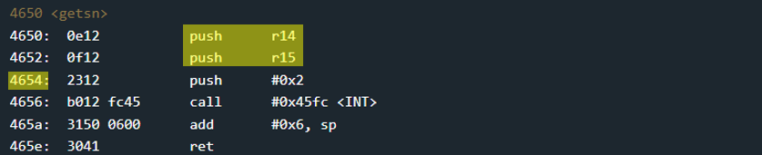

# Lagos - 150 points
 
## The idea
Bypassing a mechanism that validates input of alphanumeric characters only.

## The way

### Black box test:
It seems that it is possible to enter a password of limited length (up to 0x10 bytes), in which all characters are alphanumeric only.

</img>

But of course we don't believe it and approach the code itself.

### Explore the code:

Function `main` calls `login`, so maybe we can overwrite a return value.

***Let's explore `login`:***

</img>
</img>

1. Allocate memory on the stack for this function
    * The distance between the top of the stack and the return value is 0x12 bytes.

2. Get a password from user
    * up to 0x200 bytes
    * insert it to memory at address 0x2400

3. Init registers for the next tests

4. Checking that the current character is a number
    * if so, insert the character into the stack<br />
    (from top to bottom, after the previous character)
    * continue to check the next character.
    * otherwise, proceed to the next test.

5. Checking that the current character is a lower-case letter
    * if so, insert the character into the stack<br />
    (from top to bottom, after the previous character)
    * continue to check the next character.
    * otherwise, proceed to the next test.

6. Checking that the current character is a upper-case letter
    * if so, insert the character into the stack<br />
    (from top to bottom, after the previous character)
    * continue to check the next character.
    * Otherwise, don't check any more characters and continue with the program.

7. Cleaning the original buffer with all the input
    * So we can't use the original input to insert non-alphanumeric characters.

8. Correctness check of the password.
    * we will not be able to guess the input.
    * It will always fail.

***`login` summary:***<br />
We can insert up to 0x200 alphanumeric bytes into the stack only.<br />
We will note that any overwrite of the return value should have an address whose bytes are alphanumeric.<br />
In particular, we will notice that there is no address for the function that opens the door.<br />
And so even if we can use the `INT` address, we cannot pass the parameter 0x007f which consists of non-alphanumeric characters.

So what can we do?

### How to exploit:

We'll need a way to bypass the input check.<br />
Let's pay attention to the `getsn` function:

</img>

* _r14_ - max size of bytes for input
* _r15_ - destination address

We can notice that the address 0x4654 consists of alphanumeric bytes, so we can jump to it.<br />
In this way, we can insert another input into the memory and inject a code that consists of characters that are not alphanumeric!

Let's look at the Stack memory after the characters<br /> `3333333333333333333333333333333333 5446 3230 4141 3230`<br />
have been copied there:

</img>

* `4656` - 0x5646, "ret" into the function `getsn`
* `3230` - 0x3032, first parameter to `getsn`, the destination
* `4141` - 0x4141, second parameter to `getsn`, max length to take
* `3230` - 0x3032, "ret" from `getsn` direct into the code that will be injected in the next step.
* Note - there is 0x11 bytes with the value 0x33.<br />
Since the first character is copied to the stack twice (and then deleted), this advances us by one byte towards the return address.

And now, the user input window came up again.<br />
Into it we will insert the code injected in Bangalore's solution.

Reminder: this is the code `324000ff30401000`.<br />
And this is what it does:

```asm
; assembly code that unlocks the door.
mov 0xff00, pc
br 0x0010
```

</img>

And this is how the code injected into the memory will look, when indeed the code will jump to it.

</img>

And so the entire course of the program is blatantly bypassed.<br />
Have a nice day!

## The cracking input (as bytes)
```
3333333333333333333333333333333333 5446 3230 4141 3230
```
```
324000ff30401000
```