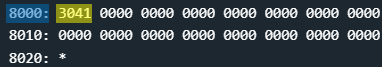

# Vancouver - 10 points
 
## The idea
Naive exploitation of a debug payload as input.

## The way

### Black box test:
This is the first challenge where the user is asked to enter an input that is a program,<br />
and not a username and password as we are used to.

</img>

In the explanation screen of the challenge, an example of input appears:

</img>

So the background story is that you can only insert programs whose role is to "map bugs",<br />
and the program `8000023041` is provided, which we still don't know how it is composed and what it does.<br />
Time to explore the code!

### Explore the code:

Let's explain the operation of the main function on the input `8000023041`:

</img>

1. Get the input - for this example: `8000023041`
    * up to 0x3ff bytes
    * insert it into memory at addres 0x2400
    * the memory looks like this:<br/>
    </img>

2. Saves the first two bytes as a number - for this example: `8000`
    * saved into register _r11_
    * Considers little endian.
    * The registers are just after this part of the code:><br />
    </img>

3. Checking that the value of the third byte is at least 2
    * if so, continue to stage 4
    * else, start from the begining again.
    * for this example: its ok because *(0x2402) == 0x2.

4. prints "Invalid payload length" and start from the begining.
    * so, we are able to map the input into 3 parts:<br />
    `8000 02 3041`
    * and we know that the third byte marks the length of the input.<br />
    since the handling of the first part of the input is fixed,<br />
    it can be concluded that the length is of the third part.
    * and because the requirement is for a "debug payload", it remains to be guessed that the third part is a program.<br />
    * test in the disassembler reveals that program `3041` is the command "ret":<br />
    </img>
    * It remains to find out what the first part of (`8000` in this case) the input is.

5. copy the input into another memory
    * in this case: the next 0x`02` bytes `3041` copies into memory at address 0x`8000`.
    * for this example: <br />
    </img>


6. calls to function that pointer to it sits on _r11_
    * for this example - calls to 0x`8000`

**In conclusion:**<br />
The program requests an input made up of 3 parts:
1. Address to which a program will be copied from the user
2. The length of the program from the user, at least 2 bytes.
3. Program to execute from the user.

Then, copies from the third part the amount of bytes specified in the second part into the memory at the address specified in the first part.

Then, actually executing the program from the user.

**For example: The input `8000 02 3041`**: copies the `02` bytes of `3041` into memory at address 0x`8000`

So, what can we do with that?

### How to exploit:

Because there is no security check at all for the code that is entered, we can enter a code that simply opens the door.

Recall the following code from the Lagos challenge:
```asm
; assembly code that unlock the door.
mov #0xff00, sr
br #0x0010
```
So, <br />
- The code after assembler is: `324000ff30401000`<br />
- The length of the code abouve is: `08`<br />
- And we can put it, for example, at address 0x`8000`.

done.

## The cracking input (as bytes)
```
8000 08 324000ff30401000
```