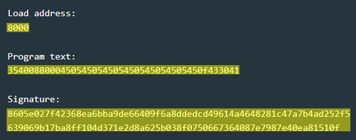
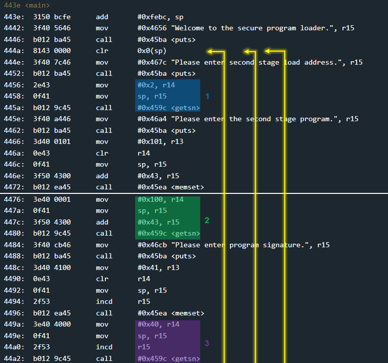
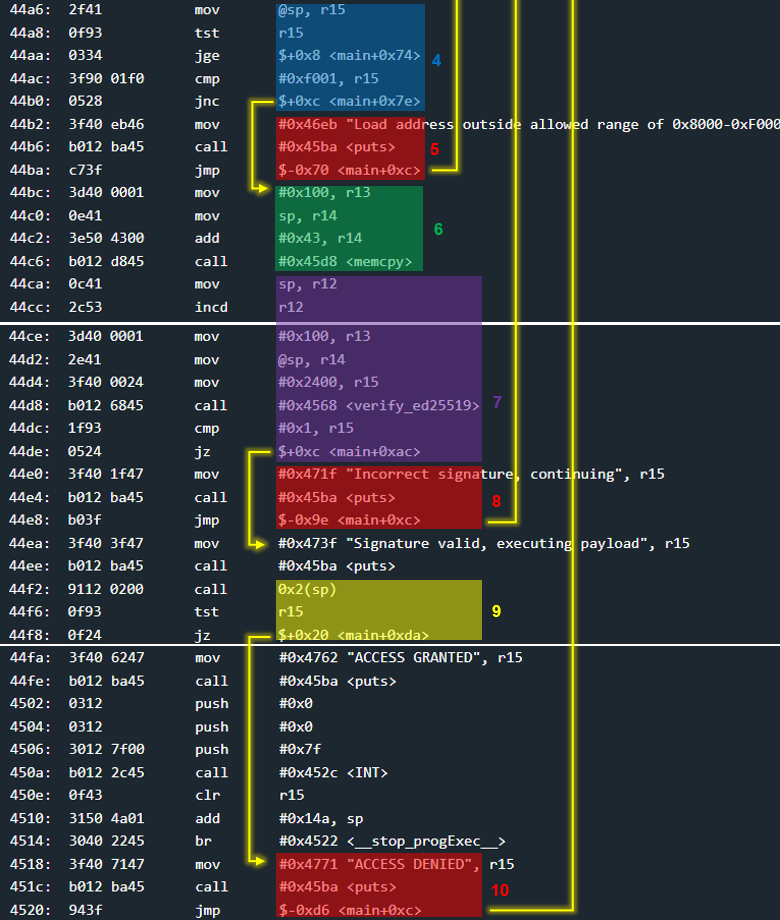
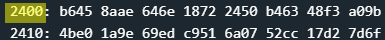
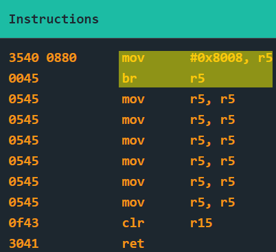
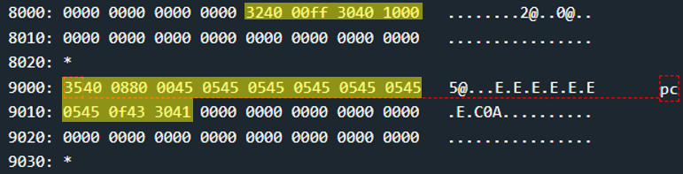

# Cold Lake - 20 points

## The idea
The digital signature ed25519.

## The way

### Black box test:
In the instructions of the challenge it becomes clear that the user has to enter an address,<br />
program and signature of the program.

</img>

In contrast to the Vancouver challenge, here it is necessary to sign the plan as a security measure.<br />
It can be concluded that we cannot execute our own program the easy way.

So, let's jump the code.

### Explore the code:

It just looks scary, but not really.

</img>
</img>

1. Get the destination address
    * 2 bytes

2. Get the program code
    * up to 0x100 bytes.

3. Get the digital signature

4. Check that address is valid
    * don't forget the little endian.<br />
    so if you want the address 0x8000, you have to enter 0080.
    * between 0x8000 - 0xf000
    * if it valid, skip stage 5

5. prints error and start program from the begining

6. copies the program (from user) to destination address.

7. Checking that the digital signature corresponds to the program from the user.
    * using `ed25519` algorithm
        * param 1 - the signature
        * param 2 - the length of the msg
        * param 3 - the msg, this is the program from user
        * param 4 - the public key, at addres 0x2400
    * if check was faild, start program from the begining.

8. prints error and start program from the begining

9. execute program from user
    * if it returns 0x0, nothing will happens.
    * else, it's unlocks the door.

10. prints "ACCESS DENIED" and start program from the begining.

***Conclusion from `main`:***
* First, the program is copied to the memory that the user wants,<br />
    and only then is it checked and not deleted anyway.
* Then only with the matching signature, the program will execute.

Can we enter our own program to open the door?

### How to exploit:

The following website presents a service where you can verify a digital signature according to the ed2219 algorithm:

https://cyphr.me/ed25519_tool/ed.html#?alg_type=Msg&msg_enc=Hex&msg=3540088000450545054505450545054505450f433041000000000000000000000000000000000000000000000000000000000000000000000000000000000000000000000000000000000000000000000000000000000000000000000000000000000000000000000000000000000000000000000000000000000000000000000000000000000000000000000000000000000000000000000000000000000000000000000000000000000000000000000000000000000000000000000000000000000000000000000000000000000000000000000000000000000000000000000000000000000000000000000000000000000000000000000000000000000000&key_enc=Hex&key=B6458AAE646E18722450B46348F3A09B4BE01A9E69EDC9516A0752CC17D27D6F&sig=8605E027F42368EA6BBA9DE66409F6A8DDEDCD49614A4648281C47A7B4AD252F5639069B17BA8FF104D371E2D8A625B038F0750667364087E7987E40EA81510F&verify
* Note: msg length is 0x100 according to the `main` code.
* The public key is at address 0x2400:<br />
</img>

But we couldn't find the private key anywhere in memory.<br />
So we can't easily generate our own code that opens the door straight away.

So let's look at the code `3540088000450545054505450545054505450f433041`<br />
provided in the example, and read what it does:

</img>

And that means that no matter where this code sits,<br />
it will jump to run the code located at address 0x8008.<br />
Conclusion: If we receive a code that opens the door at 0x8008,<br />
and then insert the code from the example<br />
(without overriding what we inserted before) - the door will open.

***Illustration:***

1. The injection of the code that opens the door to address 0x8008
    * 0x8008 - `0880`
    * the code is: `324000ff30401000`. the same code from Lagos challenge.
    * signature its unknown so any input is ok.

2. Inserting the code from the example
    * into 0x9000 - `0090`, which will not overwrite the previous code.
    * the code is `3540088000450545054505450545054505450f433041`
    * the signature is `8605e027f42368ea6bba9de66409f6a8ddedcd49614a4648281c47a7b4ad252f5639069b17ba8ff104d371e2d8a625b038f0750667364087e7987e40ea81510f`

And this is how the memory will look when the code from the example starts running:<br />

</img>

Have a nice day!

## The cracking input (as bytes)
```
0880
```
```
324000ff30401000
```
```
00
```
```
0090
```
```
3540088000450545054505450545054505450f433041
```
```
8605e027f42368ea6bba9de66409f6a8ddedcd49614a4648281c47a7b4ad252f5639069b17ba8ff104d371e2d8a625b038f0750667364087e7987e40ea81510f
```