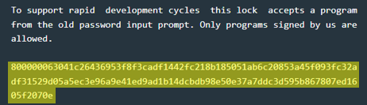

# Churchill - 30 points
 
## The idea

## The way

### Black box test:

### Explore the code:

The program is simple, but too complicated to explain in words.<br />
Therefore, immediately after it will appear its "source code" that I wrote in c.

</img>
</img>

```c
#define MAX_SIZE 0x400

#define void func(void);

typedef (short)*(0x2420) dest; // dest is r11
typedef (char)*(0x2422) flag;  // flag is r9
typedef (char)*(0x2423) size;  // size is r10

void main()
{
    // allocate stack memory:
    char stackMemory[0x40]; // -0x40 == 0xffc0

    puts("Welcome to the secure program loader.");

start:
    puts("Please enter debug payload.");
    memset(0x2420, 0, MAX_SIZE);
    getsn(0x2420, MAX_SIZE - 1);

    if(0x8000 > dest || dest > 0xf000)
    {
        puts("Load address outside allowed range 0x8000 - 0xF000");
        goto start;
    }
    
    if(size < 6)
    {
        puts("Invalid payload length");
        goto start;
    }

    // move the digital signature into the top of the stack.
    memcpy(stackMemory, 0x2420 + size, 0x40);

    if(1 == flag)
    {
        // insert sha512 of the first size bytes of input into the top of the stack
        sha512(0x2420, size, stackMemory);
        
        /* compare between the sha512 and the signature from the input.
        for example:
         - input is [8000 01 06 3041
                    c26436953f8f3cadf1442fc218b18505
                    1ab6c20853a45f093fc32adf31529d05
                    a5ec3e96a9e41ed9ad1b14dcbdb98e50
                    e37a7ddc3d595b867807ed1605f2070e]
         
         - so compare between str1 and str2:
             - str1: sha512(800001063041)
             - str2: c26436953f8f3cadf1442fc218b18505
                     1ab6c20853a45f093fc32adf31529d05
                     a5ec3e96a9e41ed9ad1b14dcbdb98e50
                     e37a7ddc3d595b867807ed1605f2070e
        */
        if (memcmp(stackMemory, 0x2420 + size, 0x40) == 1)
            goto execute;
    }
    else if(0 == flag)
    {
        if(verify_ed25519(0x2400, 0x2420, size, stackMemory) == 1)
            goto execute;
    }
    else
    {
        puts("Invalid signature type.");
        goto start;
    }

    puts("Incorrect signature, continuing");
    goto start;
        
execute:
    puts("Signature valid, executing payload");
    memcpy(dest, 0x2424, size); // copy the code to the dest.
    ((func*)dest)();            // execute the code from the user

    goto start;
}
```

Therefore, it can be said that the input is divided as follows:
* Destination address (4 bytes)
* flag (1 byte)
* size of all without signature, (1 byte)
* code to execute, ((size - 6) bytes)
* Digital signature, (up to (0x3ff - size) bytes)

For example:

</img>

* code destination address: `8000`
* flag: `00`
* size: `06`
* code: `3041`
* digital signature:<br /> `c26436953f8f3cadf1442fc218b185051ab6c20853a45f093fc32adf31529d05a5ec3e96a9e41ed9ad1b14dbdb98e50e37a7ddc3d595b867807ed1605f2070e`

We couldn't find the private key for ed25519 in memory,<br />
so we can't generate a code that opens the door in a simple way like in the example.<br />
So, what can we do?

### How to exploit:


## The cracking input (as bytes)
```

```