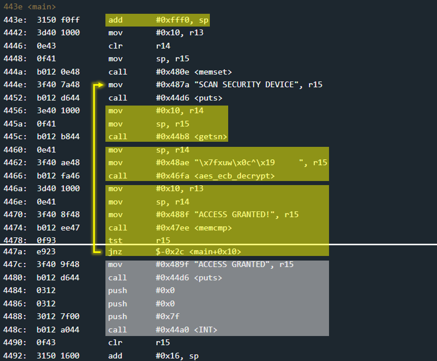

# Baku - 10 points
 
## The idea
AES ECB encryption.<br />
Never leave keys in a symmetric encryption code...

## The way

### Black box test:
This time, black box testing does not clearly show what the input should be.

</img>

So, let's explore the code.

### Explore the code:
Below is the main function.<br />
For convenience, its explanation will be c code.

</img>

```c
void main()
{
    char password[0x10];

    // clean memory
    memset(password, 0, 0x10);

start:
    // get encrypted password
    puts("SCAN SECURITY DEVICE");
    getsn(password, 0x10);

    // decrypt password
    aes_ecb_decrypt(0x48ae, password);
    
    if(memcmp("ACCESS GRANTED!", password, 0x10))
        goto start;
    
    puts("ACCESS GRANTED");
    INT(0x7f); // unlock the door.
}
```

### How to exploit:


## The cracking input (as bytes)
```

```