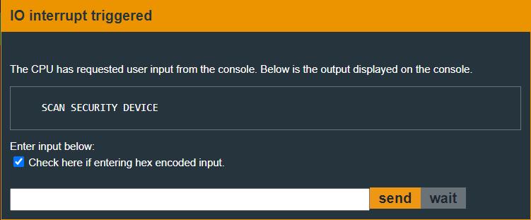
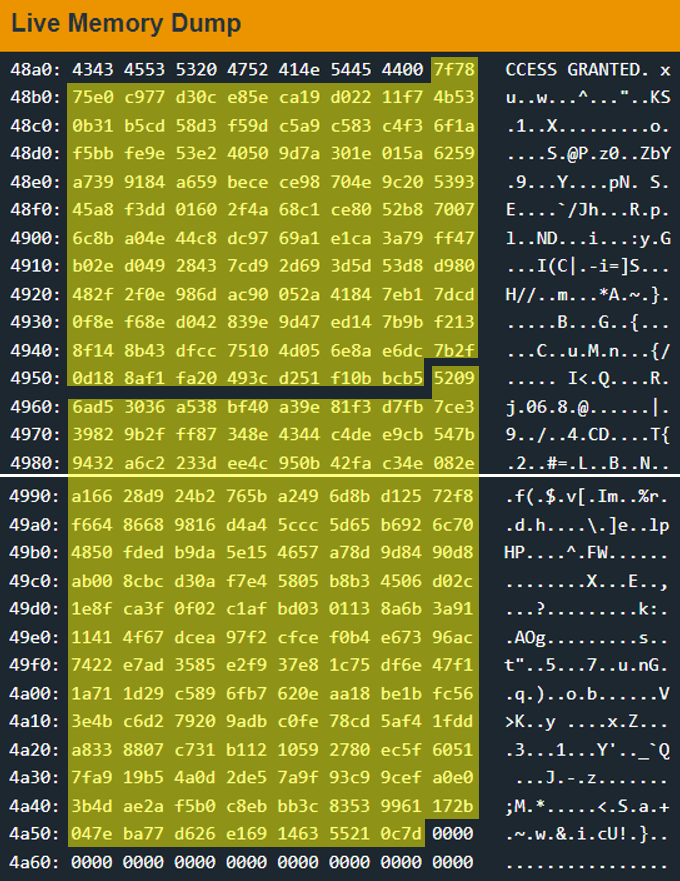

# Baku - 10 points
 
## The idea
AES ECB encryption.<br />
Never leave keys in a symmetric encryption code...

## The way

### Black box test:
This time, black box testing does not clearly show what the input should be.

</img>

So, let's explore the code.

### Explore the code:
Below is the main function.<br />
For convenience, its explanation will be c code.

</img>

```c
void main()
{
    char password[0x10];

    // clean memory
    memset(password, 0, 0x10);

start:
    // get encrypted password
    puts("SCAN SECURITY DEVICE");
    getsn(password, 0x10);

    // decrypt password
    aes_ecb_decrypt(0x48ae, password);
    
    if(memcmp("ACCESS GRANTED!", password, 0x10))
        goto start;
    
    puts("ACCESS GRANTED");
    INT(0x7f); // unlock the door.
}
```
Another thing to investigate is the 0x48ae address.<br />
Let's look at this memory:

</img>

Two important things were discovered here:<br />
1 - 11 sequences of length 0x10.<br />
2 - and the famous inverse s box table.

And the fact that the function `aes_ecb_decrypt` receives the pointer<br />
to those 11 sequences allows us to assume that these are **keys**.

If we find the encrypted bytes of the string `ACCESS GRANTED!\x00`, we will open the door.

### How to exploit:
In fact, I understood the way this encryption works from the reversing operation.<br />
And I learned about the inverse s box, the permutations, etc.<br />
In the end I came to the following conclusion:<br />
**I need to write a code for aes ecb encryption that uses inverse s box and 11 keys.**

And so I decided first to write a code that decrypt,<br />
and check if it is the same as the `aes_ecb_decrypt` function.<br />
A simple check by putting some input into the challenge<br />
and the same into the code, and comparing the two results.<br />
If they are equal then the decryption function was written correctly.

I asked https://talkai.info/chat/ for the following request:<br />
"Write code in Python for decrypting aes ecb encryption using<br />
inverse s box and 11 keys of size 16 bytes".<br />

And this is the result after entering the keys to the code:
```python
# dec.py

from Crypto.Cipher import AES

# Inverse S-Box
inv_s_box = [
    0x52, 0x09, 0x6A, 0xD5, 0x30, 0x36, 0xA5, 0x38, 0xBF, 0x40, 0xA3, 0x9E, 0x81, 0xF3, 0xD7, 0xFB,
    0x7C, 0xE3, 0x39, 0x82, 0x9B, 0x2F, 0xFF, 0x87, 0x34, 0x8E, 0x43, 0x44, 0xC4, 0xDE, 0xE9, 0xCB,
    0x54, 0x7B, 0x94, 0x32, 0xA6, 0xC2, 0x23, 0x3D, 0xEE, 0x4C, 0x95, 0x0B, 0x42, 0xFA, 0xC3, 0x4E,
    0x08, 0x2E, 0xA1, 0x66, 0x28, 0xD9, 0x24, 0xB2, 0x76, 0x5B, 0xA2, 0x49, 0x6D, 0x8B, 0xD1, 0x25,
    0x72, 0xF8, 0xF6, 0x64, 0x86, 0x68, 0x98, 0x16, 0xD4, 0xA4, 0x5C, 0xCC, 0x5D, 0x65, 0xB6, 0x92,
    0x6C, 0x70, 0x48, 0x50, 0xFD, 0xED, 0xB9, 0xDA, 0x5E, 0x15, 0x46, 0x57, 0xA7, 0x8D, 0x9D, 0x84,
    0x90, 0xD8, 0xAB, 0x00, 0x8C, 0xBC, 0xD3, 0x0A, 0xF7, 0xE4, 0x58, 0x05, 0xB8, 0xB3, 0x45, 0x06,
    0xD0, 0x2C, 0x1E, 0x8F, 0xCA, 0x3F, 0x0F, 0x02, 0xC1, 0xAF, 0xBD, 0x03, 0x01, 0x13, 0x8A, 0x6B,
    0x3A, 0x91, 0x11, 0x41, 0x4F, 0x67, 0xDC, 0xEA, 0x97, 0xF2, 0xCF, 0xCE, 0xF0, 0xB4, 0xE6, 0x73,
    0x96, 0xAC, 0x74, 0x22, 0xE7, 0xAD, 0x35, 0x85, 0xE2, 0xF9, 0x37, 0xE8, 0x1C, 0x75, 0xDF, 0x6E,
    0x47, 0xF1, 0x1A, 0x71, 0x1D, 0x29, 0xC5, 0x89, 0x6F, 0xB7, 0x62, 0x0E, 0xAA, 0x18, 0xBE, 0x1B,
    0xFC, 0x56, 0x3E, 0x4B, 0xC6, 0xD2, 0x79, 0x20, 0x9A, 0xDB, 0xC0, 0xFE, 0x78, 0xCD, 0x5A, 0xF4,
    0x1F, 0xDD, 0xA8, 0x33, 0x88, 0x07, 0xC7, 0x31, 0xB1, 0x12, 0x10, 0x59, 0x27, 0x80, 0xEC, 0x5F,
    0x60, 0x51, 0x7F, 0xA9, 0x19, 0xB5, 0x4A, 0x0D, 0x2D, 0xE5, 0x7A, 0x9F, 0x93, 0xC9, 0x9C, 0xEF,
    0xA0, 0xE0, 0x3B, 0x4D, 0xAE, 0x2A, 0xF5, 0xB0, 0xC8, 0xEB, 0xBB, 0x3C, 0x83, 0x53, 0x99, 0x61,
    0x17, 0x2B, 0x04, 0x7E, 0xBA, 0x77, 0xD6, 0x26, 0xE1, 0x69, 0x14, 0x63, 0x55, 0x21, 0x0C, 0x7D,
]

# 11 keys of size 16 bytes
keys = [
    b'\x7F\x78\x75\xE0\xC9\x77\xD3\x0C\xE8\x5E\xCA\x19\xD0\x22\x11\xF7',
    b'\x4B\x53\x0B\x31\xB5\xCD\x58\xD3\xF5\x9D\xC5\xA9\xC5\x83\xC4\xF3',
    b'\x6F\x1A\xF5\xBB\xFE\x9E\x53\xE2\x40\x50\x9D\x7A\x30\x1E\x01\x5A',
    b'\x62\x59\xA7\x39\x91\x84\xA6\x59\xBE\xCE\xCE\x98\x70\x4E\x9C\x20',
    b'\x53\x93\x45\xA8\xF3\xDD\x01\x60\x2F\x4A\x68\xC1\xCE\x80\x52\xB8',
    b'\x70\x07\x6C\x8B\xA0\x4E\x44\xC8\xDC\x97\x69\xA1\xE1\xCA\x3A\x79',
    b'\xFF\x47\xB0\x2E\xD0\x49\x28\x43\x7C\xD9\x2D\x69\x3D\x5D\x53\xD8',
    b'\xD9\x80\x48\x2F\x2F\x0E\x98\x6D\xAC\x90\x05\x2A\x41\x84\x7E\xB1',
    b'\x7D\xCD\x0F\x8E\xF6\x8E\xD0\x42\x83\x9E\x9D\x47\xED\x14\x7B\x9B',
    b'\xF2\x13\x8F\x14\x8B\x43\xDF\xCC\x75\x10\x4D\x05\x6E\x8A\xE6\xDC',
    b'\x7B\x2F\x0D\x18\x8A\xF1\xFA\x20\x49\x3C\xD2\x51\xF1\x0B\xBC\xB5'
][::-1]

# AES block size (in bytes)
block_size = 16

def inverse_s_box(sub_bytes):
    # Perform inverse substitution using the inverse S-Box
    return bytes(inv_s_box[b] for b in sub_bytes)

def decrypt_aes_ecb(ciphertext, keys):
    # Create an AES object with ECB mode (no padding)
    cipher = AES.new(keys[0], AES.MODE_ECB)

    # Decrypt the first block
    plaintext = cipher.decrypt(ciphertext[:block_size])

    # Perform inverse round transformation for subsequent blocks
    for i in range(1, len(ciphertext) // block_size):
        ciphertext_block = ciphertext[i * block_size:(i + 1) * block_size]
        decrypted_block = inverse_s_box(cipher.decrypt(ciphertext_block))

        # XOR decrypted block with the corresponding key
        plaintext_block = bytes(d ^ k for (d, k) in zip(decrypted_block, keys[i]))

        plaintext += plaintext_block

    return plaintext

# Test decryption
ciphertext = b'\x00\x00\x00\x00\x00\x00\x00\x00\x00\x00\x00\x00\x00\x00\x00\x00'  # Replace with your actual ciphertext
plaintext = decrypt_aes_ecb(ciphertext, keys)
print(plaintext)
```

Now we will check if the code is correct.
Checking the code will print us a string with<br />
the values of the bytes in which they are: `eb449694626f0227fe7b4d2025ca647e`

And in the code of the challenge itself we will<br />
get the same thing by entering the input `000000000000000000000000000000000`:

</img>

The same thing came out, meaning the code is correct.<br />
Now we will build the appropriate code for encryption.

So I asked https://talkai.info/chat/ to build an encryption code<br />
that matches the decryption code above.<br />
Below is the result:

```python
# enc.py

from Crypto.Cipher import AES

# 11 keys of size 16 bytes
keys = [
    b'\x7F\x78\x75\xE0\xC9\x77\xD3\x0C\xE8\x5E\xCA\x19\xD0\x22\x11\xF7',
    b'\x4B\x53\x0B\x31\xB5\xCD\x58\xD3\xF5\x9D\xC5\xA9\xC5\x83\xC4\xF3',
    b'\x6F\x1A\xF5\xBB\xFE\x9E\x53\xE2\x40\x50\x9D\x7A\x30\x1E\x01\x5A',
    b'\x62\x59\xA7\x39\x91\x84\xA6\x59\xBE\xCE\xCE\x98\x70\x4E\x9C\x20',
    b'\x53\x93\x45\xA8\xF3\xDD\x01\x60\x2F\x4A\x68\xC1\xCE\x80\x52\xB8',
    b'\x70\x07\x6C\x8B\xA0\x4E\x44\xC8\xDC\x97\x69\xA1\xE1\xCA\x3A\x79',
    b'\xFF\x47\xB0\x2E\xD0\x49\x28\x43\x7C\xD9\x2D\x69\x3D\x5D\x53\xD8',
    b'\xD9\x80\x48\x2F\x2F\x0E\x98\x6D\xAC\x90\x05\x2A\x41\x84\x7E\xB1',
    b'\x7D\xCD\x0F\x8E\xF6\x8E\xD0\x42\x83\x9E\x9D\x47\xED\x14\x7B\x9B',
    b'\xF2\x13\x8F\x14\x8B\x43\xDF\xCC\x75\x10\x4D\x05\x6E\x8A\xE6\xDC',
    b'\x7B\x2F\x0D\x18\x8A\xF1\xFA\x20\x49\x3C\xD2\x51\xF1\x0B\xBC\xB5'
][::-1]

# AES block size (in bytes)
block_size = 16


def s_box(sub_bytes):
    # Perform substitution using the S-Box
    return bytes(s_box[b] for b in sub_bytes)

def encrypt_aes_ecb(plaintext, keys):
    # Create an AES object with ECB mode (no padding)
    cipher = AES.new(keys[0], AES.MODE_ECB)

    # Encrypt the first block
    ciphertext = cipher.encrypt(plaintext[:block_size])

    # Perform round transformation for subsequent blocks
    for i in range(1, len(plaintext) // block_size):
        plaintext_block = plaintext[i * block_size:(i + 1) * block_size]

        # XOR plaintext block with the corresponding key
        xor_block = bytes(p ^ k for (p, k) in zip(plaintext_block, keys[i]))

        # Apply substitution using the S-Box
        sub_bytes = s_box(xor_block)

        # Encrypt the block
        encrypted_block = cipher.encrypt(sub_bytes)

        ciphertext += encrypted_block

    return ciphertext

plaintext = b'ACCESS GRANTED!\x00'  # Replace with your actual plaintext
ciphertext = encrypt_aes_ecb(plaintext, keys)
print(ciphertext)
```

So the above code will print for the value `ACCESS GRANTED!\x00`<br />
these bytes: `aaf7e3ad17bcfd3240422d65fe3ea1b7`

And the dec.py will print for the value `aaf7e3ad17bcfd3240422d65fe3ea1b7`<br />
this string: `ACCESS GRANTED!\x00`.

**In conclusion:**<br />
aes_ecb_decrypt(keys, `aaf7e3ad17bcfd3240422d65fe3ea1b7`) == `ACCESS GRANTED!\x00`

Have a nice day!

## The cracking input (as bytes)
```
aaf7e3ad17bcfd3240422d65fe3ea1b7
```