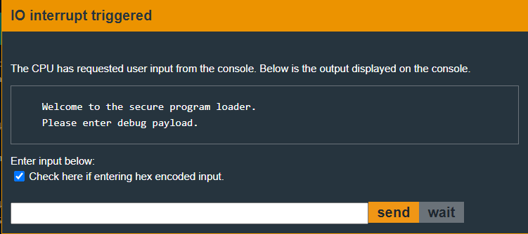

# St. John's - 20 points
 
## The idea
The digital signature ed25519.
Never leave a private key in the source code. Never!

## The way

### Black box test:
A black box test will show us that the input is a debug pyload,<br />
just like in the Churchill challenge.

</img>
</img>

At first glance it seems that the input is just like in the Churchill challenge.<br />
Let's jump to the code.

### Explore the code:
I will not analyze the entire code this time, because the case here is very simple.<br />
Let's look at the main part of the code in `main`:

</img>

* param1 - _r15_, the public key at address 0x2440
* param2 - _r14_, the msg, this is the program from user
* param3 - _r13_, size
* param4 - _r12_, the signature from user.

If this test passes successfully, the injected code will run.

Can we easily build a debug payload that will open the door?

### How to exploit:
Yes we can.

We will notice the address 0x2400 which has not been used yet, which raises suspicion.

</img>

* blue - the public key
* yellow - maybe the **private key?!**

A simple check shows that the suspect string does indeed create the public key.<br />
https://cyphr.me/ed25519_tool/ed.html#?alg_type=Msg&msg_enc=Text&key_enc=Hex&seed=70c3679b43365ca01131991cc462135becae7df973d62b163c05c679746ce52f&key=08218D19996D174F147F157B9F2C80114AB3D2D12532D2EAB925616146A815BE&verify
Which means it is indeed the private key.

From here it will be very easy to build a debug payload:
* destination address - `8000`
* flag(?) - `00`
* size - `0c`
* code - `324000ff30401000`
    * The code we also used in previous challenges to open a door.
    * You can check for yourself what he does.
* signature - `c93b0af6f19a8c2daa08a598ce755275760ccab5036092170b55f15935c2a21f512c146876528590d65f46845263f4388e1178dbbcf0ca89e9244e2d52ab3d0e`<br />

    * https://cyphr.me/ed25519_tool/ed.html#?alg_type=Msg&msg_enc=Hex&msg=8000000c324000ff30401000&key_enc=Hex&seed=70c3679b43365ca01131991cc462135becae7df973d62b163c05c679746ce52f&key=08218D19996D174F147F157B9F2C80114AB3D2D12532D2EAB925616146A815BE&sig=C93B0AF6F19A8C2DAA08A598CE755275760CCAB5036092170B55F15935C2A21F512C146876528590D65F46845263F4388E1178DBBCF0CA89E9244E2D52AB3D0E&verify

And that's it. Have a nice day!

## The cracking input (as bytes)
```
8000 00 0c 324000ff30401000 c93b0af6f19a8c2daa08a598ce755275760ccab5036092170b55f15935c2a21f512c146876528590d65f46845263f4388e1178dbbcf0ca89e9244e2d52ab3d0e
```