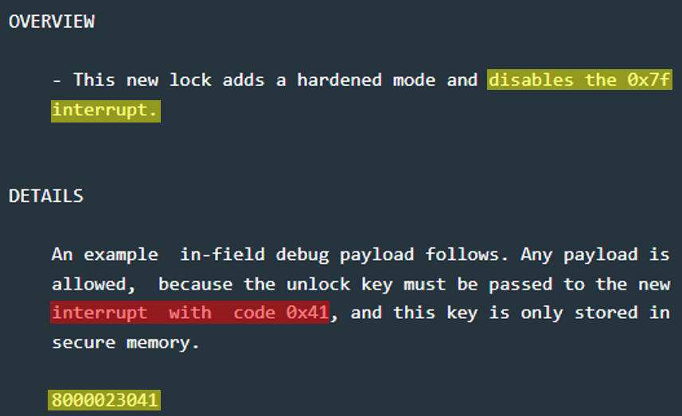
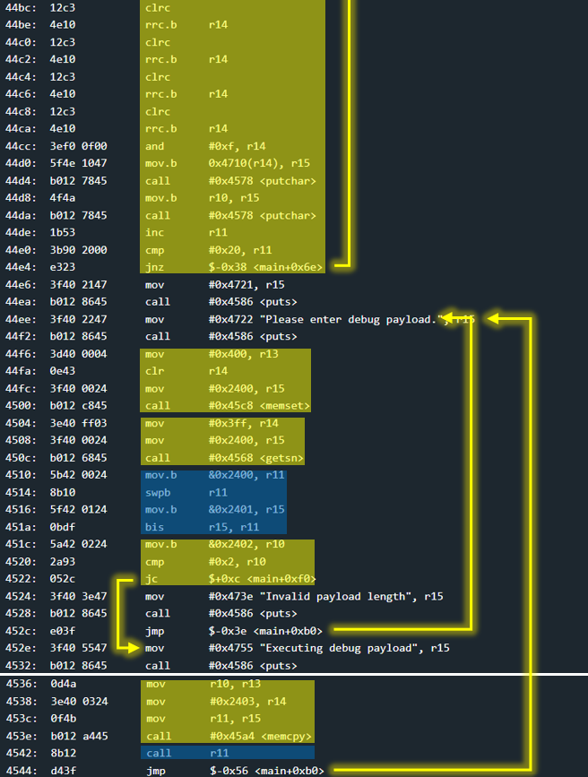
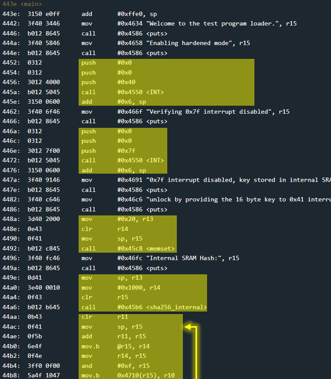
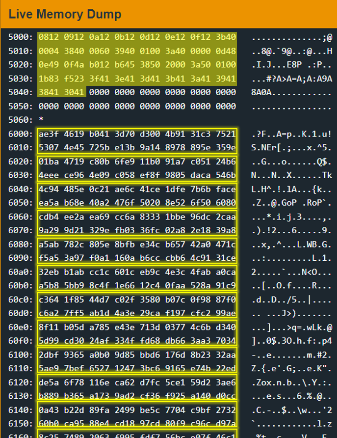
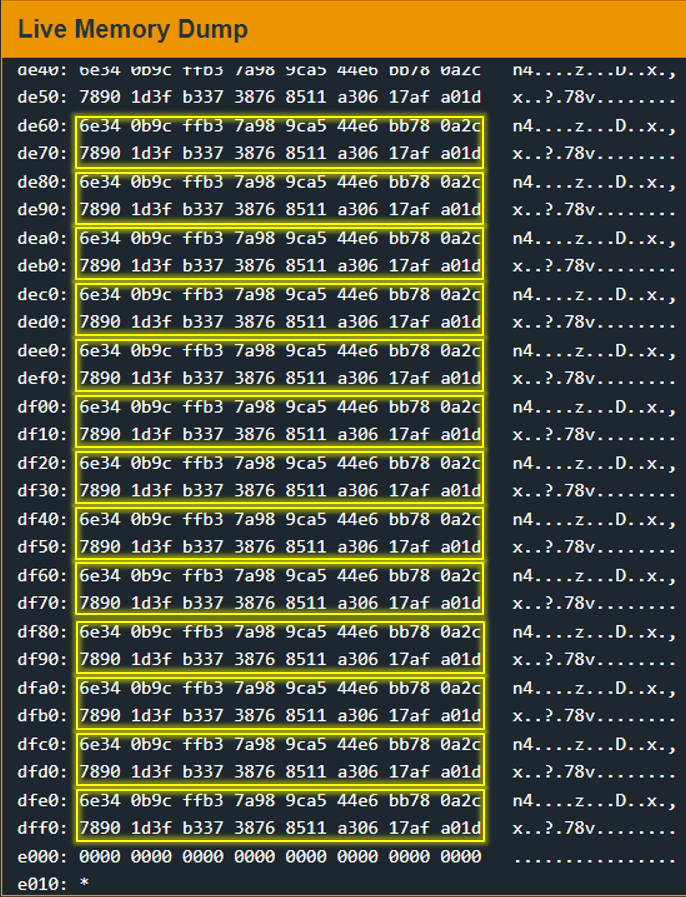
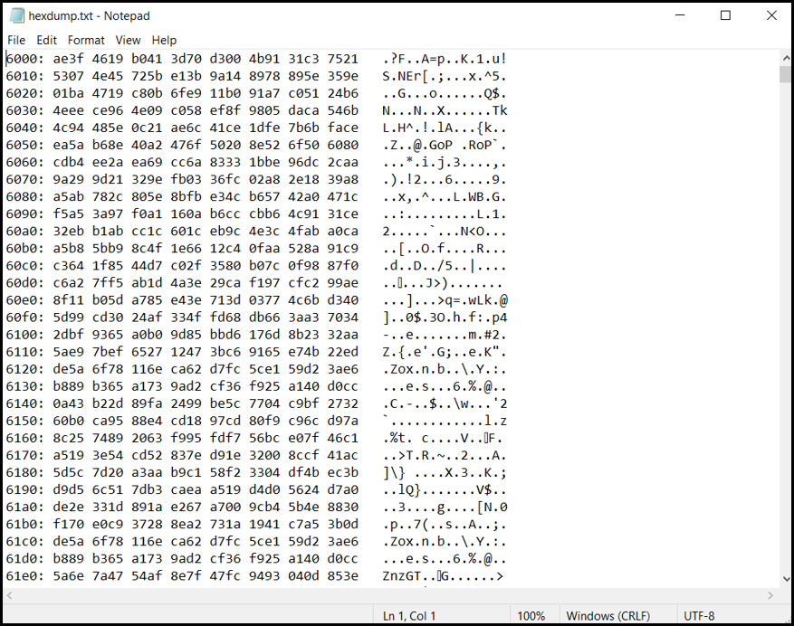

# Halifax - 20 points
 
## The idea
Exploitation of the ability to extract the hash of any part I want,<br />
and in any size I want, from a memory that is not accessible.

## The way

### Black box test:
Let's look at the challenge instructions:

</img>
* we can't unlock the door by 0x7f interrupt anymore
* ther is a mistake here. it's 0x42.
* payload is very clearly. we can divide it to 3 parts:
    * dest - `8000`
    * size of code - `02`
    * code - `3041`

Let's also look at how it looks in the user window:

</img>
* red - it's a mistake. 0x42, not 0x41.

Let's explore the code.

### Explore the code:

Below is the main function of the program.<br />
Immediately afterwards a reconstruction of this code will appear in c.<br />
I did this to make it easier to explain, so read it carefully as well.

</img>
</img>

```c
#define MAX_SIZE 0x400
#define void func(void);

typedef (short)*(0x2400) dest;
typedef (char)*(0x2402) size;

void main()
{
    char stack_memory[0x20];

    puts("Welcome to the test program loader.");

    puts("Enablibg hardened mode");
    INT(0x40); // interrupt for harden mode.

    puts("Verifying 0x7f interrupt disable");
    INT(0x7f); // unlock-the-door interrupt doesn't work anymore.
    puts("0x7f interrupt disabled, key stored in internal SRAM");

    // there is a mistake here. the interrupt number is 0x42, not 0x41.
    puts("unlock by providing the 16 byte key to 0x42 interrupt");

    // extract result of sha256(SRAM) into the top of the stack.
    memset(stack_memory, 0, 0x20);
    puts("Internul SRAM Hash:");
    sha256_internal(0, 0x1000, stack_memory);

    /*
        Some loop that prints the result of the abouve function.
        From the stack, to the screen.
    */

    while(1)
    {
        puts("Please enter debug payload.");
        memset(0x2400, 0, MAX_SIZE);
        getsn(0x2400, MAX_SIZE - 1);

        if(size < 2)
        {
            puts("Invalid payload length");
            continue;
        }

        puts("Executing debug payload");
        memcpy(dest, 0x2403, size);  // copy user program into dest
        ((func*)dest)();             // execute the user program
    }
}
```

So we can run any code we want, but we won't be able to open the door with the 0x7f interface like we did in all the previous challenges.<br />

Let's pay attention to the `sha256_internal` function:
* param1 - offset from the beginning of the SRAM.
* param2 - size of bytes from the offset to take
* param3 - Destination address for the memory accessible to us, to which the result of the function will be written.
    * The result is the sha256 of the bytes we selected from the SRAM.

So the password is somewhere in a memory area whose size is 0x1000 bytes and which is not accessible to us.<br />

what can we do?

### How to exploit:
Let's pay attention again to the `sha256_internal` function.<br />
It does not limit the amount of bytes it hashes.<br />
That means you can also extract each byte there separately.<br />
Therefore, as a start only, we will try to extract all the SRAM and hash it.<br />
The following code extracts the first 0x400 bytes from SRAM, where each byte becomes a 16-byte hash and is stored in memory.

```asm
; save registers
push	r8
push	r9
push	r10
push	r11
push	r13
push	r14
push	r15

; init values.
mov	#0x400, r11 ; i = 0x400
mov	#0x6000, r8 ; init destination
mov	#0x1, r9    ; init size
clr	r10         ; init offset from start of SRAM.

; while loop
mov	r8, r13
mov	r9, r14
mov	r10, r15
call	#0x45b6 ; sha256(offset, size, dest)
add	#0x20, r8   ; the next dest address, so as not to overrun the previous result.
inc	r10         ; offset++
dec	r11         ; i--
jnz	$-0x14      ; while(i>0) 

; restoring registers
pop	r15
pop	r14
pop	r13
pop	r11
pop	r10
pop	r9
pop	r8
ret
```

So this is the code: `081209120a120b120d120e120f123b40000438400060394001003a4000000d480e490f4ab012b645385020003a5001001b83f5233f413e413d413b413a41394138413041`<br />
Size is: 0x44<br />
And we will arbitrarily decide that the code will enter address 0x5000.
We will add them all and get: `5000 44 081209120a120b120d120e120f123b40000438400060394001003a4000000d480e490f4ab012b645385020003a5001001b83f5233f413e413d413b413a41394138413041`<br />
And now we will see the results in memory:

</img>
* First part is the code at address 0x5000
* The second is the sha256 of all the first 0x400 bytes.
    * sha256(0, 1, 0x6000)
    * sha256(1, 1, 0x6020)
    * sha256(2, 1, 0x6040)
    * sha256(3, 1, 0x6060)
    * ...
    * sha256(0x400, 1, 0xdfe0)

Before we get the SRAM bytes out of what came out, we will note that at some point the value of all the bytes is the same.

</img>
* sha256('\x00') == 6e340b9cffb37a989ca544e6bb780a2c78901d3fb33738768511a30617afa01d
* That means we won't have to look for the password in all the SRAM...

Now we will copy all of this hex dump into a text file, and create a program that will decode it and print the entire SRAM in bytes.<br />
Note: We only extracted 0x400 bytes out of 0x1000.<br />
Therefore we will fill in all the rest with zeros.

</img>

```python
from hashlib import sha256

FILENAME = "hexdump"

def extract_hashs():
    # extract lines of content
    with open(FILENAME, 'r') as hexdump_file:
        hexdump_lines = hexdump_file.readlines()
    
    # extract just the binaries content from heach line
    bytes_str = ''
    for line in hexdump_lines:
        bytes_str += line[6:46].replace(' ', '')
    
    # divide bytes to groups of 32 bytes (size of sha256)
    # note: 64=32*2 because every letter here actualy is byte, but represent nibble..
    return [bytes_str[64*i:64*(i+1)] for i in range(len(bytes_str)//64)]

   
def get_0x400_bytes_by_hash(first_0x400_hashs):
    dict_256_hashs = {}
    for i in range(256):
        dict_256_hashs.update({sha256(bytes.fromhex(hex(i)[2:].zfill(2))).hexdigest():i})
    
    return [dict_256_hashs.get(h) for h in first_0x400_hashs] 
 

def save(first_0x400_bytes):    
    sram_bytes_as_hex = ''
    for b in first_0x400_bytes:
        sram_bytes_as_hex += hex(b)[2:].zfill(2)
    
    sram_bytes_as_hex += '00' * (0x1000-0x400)
    print("SRAM 0x00-0x1000:")
    print(sram_bytes_as_hex)
    print("sha256(SRAM) =", sha256(bytes.fromhex(sram_bytes_as_hex)).hexdigest())
 
   
def main():
    save(get_0x400_bytes_by_hash(extract_hashs()))


if __name__ == '__main__':
    main()
```


## The cracking input (as bytes)
```

```