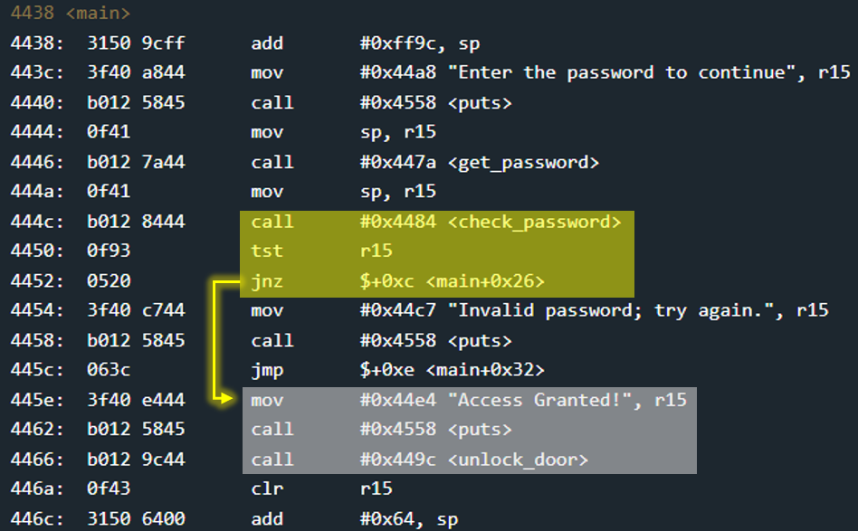
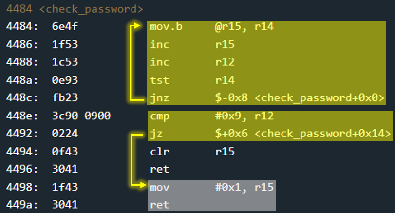

# Tutorial - 10 points
 
## The idea
A very simple challenge which includes detailed instruction of the Microcorruption interface.

## The way
In function `main` you can see that the door will open when the value returned from the `check_password` function is not 0.

Note: r15 is the register that recive the return value from functions.

Therefore, we will examine the `check_password` function. It seems that the password will be accepted as long as it contains exactly 0x8 bytes (not including the 0x0 at the end of the string).

So, the password will be any series of 0x8 bytes.

## The cracking input (as bytes)
> 0102030405060708

